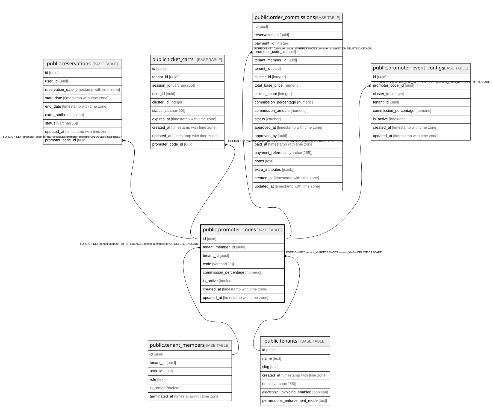

# public.promoter_codes

## Columns

| Name | Type | Default | Nullable | Children | Parents | Comment |
| ---- | ---- | ------- | -------- | -------- | ------- | ------- |
| id | uuid | gen_random_uuid() | false | [public.reservations](public.reservations.md) [public.ticket_carts](public.ticket_carts.md) [public.order_commissions](public.order_commissions.md) [public.promoter_event_configs](public.promoter_event_configs.md) |  |  |
| tenant_member_id | uuid |  | false |  | [public.tenant_members](public.tenant_members.md) |  |
| tenant_id | uuid |  | false |  | [public.tenants](public.tenants.md) |  |
| code | varchar(20) |  | false |  |  |  |
| commission_percentage | numeric |  | true |  |  |  |
| is_active | boolean | true | true |  |  |  |
| created_at | timestamp with time zone | now() | true |  |  |  |
| updated_at | timestamp with time zone | now() | true |  |  |  |

## Constraints

| Name | Type | Definition |
| ---- | ---- | ---------- |
| promoter_codes_tenant_member_fkey | FOREIGN KEY | FOREIGN KEY (tenant_member_id) REFERENCES tenant_members(id) ON DELETE CASCADE |
| promoter_codes_tenant_fkey | FOREIGN KEY | FOREIGN KEY (tenant_id) REFERENCES tenants(id) ON DELETE CASCADE |
| promoter_codes_pkey | PRIMARY KEY | PRIMARY KEY (id) |
| promoter_codes_code_key | UNIQUE | UNIQUE (code) |
| unique_promoter_per_tenant | UNIQUE | UNIQUE (tenant_member_id, tenant_id) |

## Indexes

| Name | Definition |
| ---- | ---------- |
| promoter_codes_pkey | CREATE UNIQUE INDEX promoter_codes_pkey ON public.promoter_codes USING btree (id) |
| promoter_codes_code_key | CREATE UNIQUE INDEX promoter_codes_code_key ON public.promoter_codes USING btree (code) |
| unique_promoter_per_tenant | CREATE UNIQUE INDEX unique_promoter_per_tenant ON public.promoter_codes USING btree (tenant_member_id, tenant_id) |
| idx_promoter_codes_code | CREATE INDEX idx_promoter_codes_code ON public.promoter_codes USING btree (code) |
| idx_promoter_codes_tenant | CREATE INDEX idx_promoter_codes_tenant ON public.promoter_codes USING btree (tenant_id) |

## Relations

---

> Generated by [tbls](https://github.com/k1LoW/tbls)
