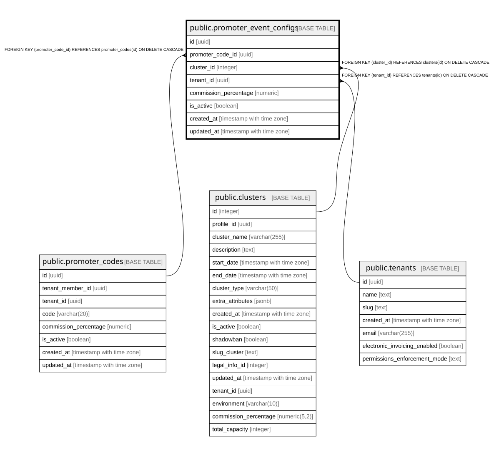

# public.promoter_event_configs

## Columns

| Name | Type | Default | Nullable | Children | Parents | Comment |
| ---- | ---- | ------- | -------- | -------- | ------- | ------- |
| id | uuid | gen_random_uuid() | false |  |  |  |
| promoter_code_id | uuid |  | false |  | [public.promoter_codes](public.promoter_codes.md) |  |
| cluster_id | integer |  | false |  | [public.clusters](public.clusters.md) |  |
| tenant_id | uuid |  | false |  | [public.tenants](public.tenants.md) |  |
| commission_percentage | numeric |  | false |  |  |  |
| is_active | boolean | true | true |  |  |  |
| created_at | timestamp with time zone | now() | true |  |  |  |
| updated_at | timestamp with time zone | now() | true |  |  |  |

## Constraints

| Name | Type | Definition |
| ---- | ---- | ---------- |
| pec_cluster_fkey | FOREIGN KEY | FOREIGN KEY (cluster_id) REFERENCES clusters(id) ON DELETE CASCADE |
| pec_tenant_fkey | FOREIGN KEY | FOREIGN KEY (tenant_id) REFERENCES tenants(id) ON DELETE CASCADE |
| pec_promoter_code_fkey | FOREIGN KEY | FOREIGN KEY (promoter_code_id) REFERENCES promoter_codes(id) ON DELETE CASCADE |
| promoter_event_configs_pkey | PRIMARY KEY | PRIMARY KEY (id) |
| unique_promoter_event | UNIQUE | UNIQUE (promoter_code_id, cluster_id) |

## Indexes

| Name | Definition |
| ---- | ---------- |
| promoter_event_configs_pkey | CREATE UNIQUE INDEX promoter_event_configs_pkey ON public.promoter_event_configs USING btree (id) |
| unique_promoter_event | CREATE UNIQUE INDEX unique_promoter_event ON public.promoter_event_configs USING btree (promoter_code_id, cluster_id) |
| idx_pec_promoter_code | CREATE INDEX idx_pec_promoter_code ON public.promoter_event_configs USING btree (promoter_code_id) |
| idx_pec_cluster | CREATE INDEX idx_pec_cluster ON public.promoter_event_configs USING btree (cluster_id) |
| idx_pec_tenant | CREATE INDEX idx_pec_tenant ON public.promoter_event_configs USING btree (tenant_id) |

## Relations

---

> Generated by [tbls](https://github.com/k1LoW/tbls)
