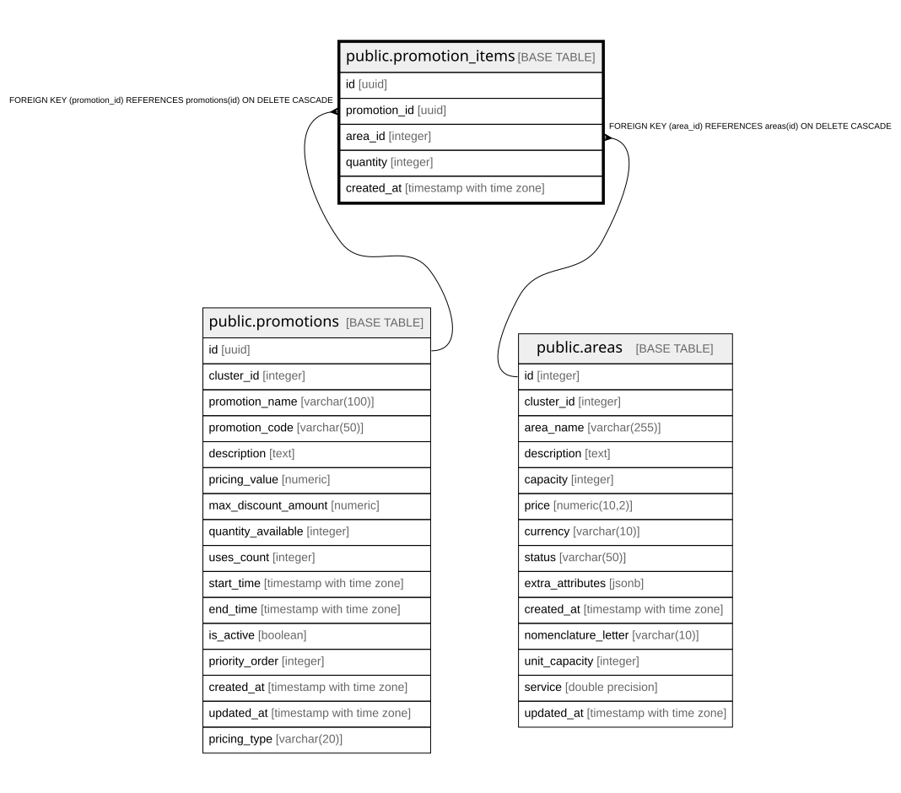

# public.promotion_items

## Columns

| Name | Type | Default | Nullable | Children | Parents | Comment |
| ---- | ---- | ------- | -------- | -------- | ------- | ------- |
| id | uuid | gen_random_uuid() | false |  |  |  |
| promotion_id | uuid |  | false |  | [public.promotions](public.promotions.md) |  |
| area_id | integer |  | false |  | [public.areas](public.areas.md) |  |
| quantity | integer | 1 | false |  |  |  |
| created_at | timestamp with time zone | now() | false |  |  |  |

## Constraints

| Name | Type | Definition |
| ---- | ---- | ---------- |
| promotion_items_quantity_check | CHECK | CHECK ((quantity >= 1)) |
| promotion_items_area_id_fkey | FOREIGN KEY | FOREIGN KEY (area_id) REFERENCES areas(id) ON DELETE CASCADE |
| promotion_items_promotion_id_fkey | FOREIGN KEY | FOREIGN KEY (promotion_id) REFERENCES promotions(id) ON DELETE CASCADE |
| promotion_items_pkey | PRIMARY KEY | PRIMARY KEY (id) |
| promotion_items_promotion_id_area_id_key | UNIQUE | UNIQUE (promotion_id, area_id) |

## Indexes

| Name | Definition |
| ---- | ---------- |
| promotion_items_pkey | CREATE UNIQUE INDEX promotion_items_pkey ON public.promotion_items USING btree (id) |
| promotion_items_promotion_id_area_id_key | CREATE UNIQUE INDEX promotion_items_promotion_id_area_id_key ON public.promotion_items USING btree (promotion_id, area_id) |
| idx_promotion_items_promotion | CREATE INDEX idx_promotion_items_promotion ON public.promotion_items USING btree (promotion_id) |
| idx_promotion_items_area | CREATE INDEX idx_promotion_items_area ON public.promotion_items USING btree (area_id) |

## Relations

---

> Generated by [tbls](https://github.com/k1LoW/tbls)
