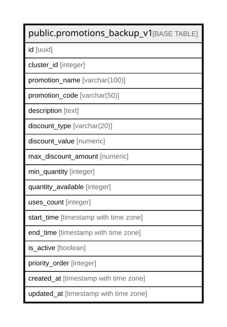

# public.promotions_backup_v1

## Columns

| Name | Type | Default | Nullable | Children | Parents | Comment |
| ---- | ---- | ------- | -------- | -------- | ------- | ------- |
| id | uuid |  | true |  |  |  |
| cluster_id | integer |  | true |  |  |  |
| promotion_name | varchar(100) |  | true |  |  |  |
| promotion_code | varchar(50) |  | true |  |  |  |
| description | text |  | true |  |  |  |
| discount_type | varchar(20) |  | true |  |  |  |
| discount_value | numeric |  | true |  |  |  |
| max_discount_amount | numeric |  | true |  |  |  |
| min_quantity | integer |  | true |  |  |  |
| quantity_available | integer |  | true |  |  |  |
| uses_count | integer |  | true |  |  |  |
| start_time | timestamp with time zone |  | true |  |  |  |
| end_time | timestamp with time zone |  | true |  |  |  |
| is_active | boolean |  | true |  |  |  |
| priority_order | integer |  | true |  |  |  |
| created_at | timestamp with time zone |  | true |  |  |  |
| updated_at | timestamp with time zone |  | true |  |  |  |

## Relations

---

> Generated by [tbls](https://github.com/k1LoW/tbls)
