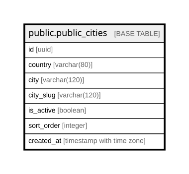

# public.public_cities

## Description

Curated catalog of cities WARO operates in (warocol.com#615). Used to populate the city selector on /negocio, the discovery section on /, and the reserved-words check in tenants_service._generate_slug. Adding a city here makes warocol.com/{city_slug} reachable; removing it requires reassigning any tenants that reference it.

## Columns

| Name | Type | Default | Nullable | Children | Parents | Comment |
| ---- | ---- | ------- | -------- | -------- | ------- | ------- |
| id | uuid | gen_random_uuid() | false |  |  |  |
| country | varchar(80) | 'Colombia'::character varying | false |  |  |  |
| city | varchar(120) |  | false |  |  |  |
| city_slug | varchar(120) |  | false |  |  |  |
| is_active | boolean | true | false |  |  |  |
| sort_order | integer | 100 | false |  |  |  |
| created_at | timestamp with time zone | now() | false |  |  |  |

## Constraints

| Name | Type | Definition |
| ---- | ---- | ---------- |
| public_cities_pkey | PRIMARY KEY | PRIMARY KEY (id) |
| public_cities_city_slug_key | UNIQUE | UNIQUE (city_slug) |

## Indexes

| Name | Definition |
| ---- | ---------- |
| public_cities_pkey | CREATE UNIQUE INDEX public_cities_pkey ON public.public_cities USING btree (id) |
| public_cities_city_slug_key | CREATE UNIQUE INDEX public_cities_city_slug_key ON public.public_cities USING btree (city_slug) |
| idx_public_cities_active | CREATE INDEX idx_public_cities_active ON public.public_cities USING btree (is_active, sort_order) WHERE (is_active = true) |

## Relations

---

> Generated by [tbls](https://github.com/k1LoW/tbls)
