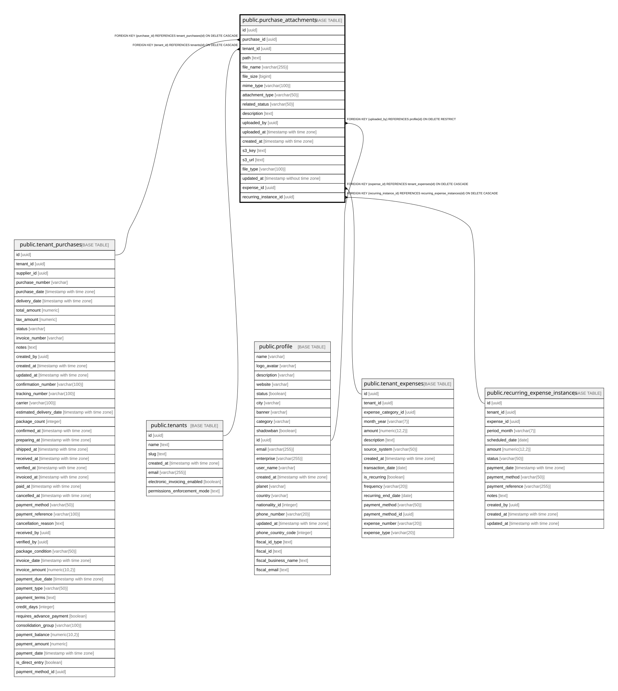

# public.purchase_attachments

## Description

Stores file attachments (invoices, receipts, contracts, etc.) for purchase orders

## Columns

| Name | Type | Default | Nullable | Children | Parents | Comment |
| ---- | ---- | ------- | -------- | -------- | ------- | ------- |
| id | uuid | gen_random_uuid() | false |  |  |  |
| purchase_id | uuid |  | true |  | [public.tenant_purchases](public.tenant_purchases.md) |  |
| tenant_id | uuid |  | false |  | [public.tenants](public.tenants.md) |  |
| path | text |  | false |  |  | Full URL or path to file in Cloudflare R2 storage |
| file_name | varchar(255) |  | false |  |  |  |
| file_size | bigint |  | true |  |  | File size in bytes |
| mime_type | varchar(100) |  | true |  |  |  |
| attachment_type | varchar(50) |  | false |  |  | Type of attachment: invoice, receipt, contract, delivery_note, quotation, or other |
| related_status | varchar(50) |  | true |  |  |  |
| description | text |  | true |  |  |  |
| uploaded_by | uuid |  | false |  | [public.profile](public.profile.md) |  |
| uploaded_at | timestamp with time zone | now() | true |  |  |  |
| created_at | timestamp with time zone | now() | true |  |  |  |
| s3_key | text |  | true |  |  |  |
| s3_url | text |  | true |  |  |  |
| file_type | varchar(100) |  | true |  |  |  |
| updated_at | timestamp without time zone | now() | false |  |  |  |
| expense_id | uuid |  | true |  | [public.tenant_expenses](public.tenant_expenses.md) | Reference to expense if this attachment belongs to an expense (mutually exclusive with purchase_id) |
| recurring_instance_id | uuid |  | true |  | [public.recurring_expense_instances](public.recurring_expense_instances.md) | FK to recurring_expense_instances for instance-specific attachments |

## Constraints

| Name | Type | Definition |
| ---- | ---- | ---------- |
| check_attachment_belongs_to_one | CHECK | CHECK ((((purchase_id IS NOT NULL) AND (expense_id IS NULL) AND (recurring_instance_id IS NULL)) OR ((purchase_id IS NULL) AND (expense_id IS NOT NULL) AND (recurring_instance_id IS NULL)) OR ((purchase_id IS NULL) AND (expense_id IS NULL) AND (recurring_instance_id IS NOT NULL)))) |
| chk_path_not_empty | CHECK | CHECK ((length(TRIM(BOTH FROM path)) > 0)) |
| chk_valid_attachment_type | CHECK | CHECK (((attachment_type)::text = ANY (ARRAY[('purchase_order'::character varying)::text, ('confirmation'::character varying)::text, ('shipping_label'::character varying)::text, ('invoice'::character varying)::text, ('payment_proof'::character varying)::text, ('quality_photo'::character varying)::text, ('delivery_photo'::character varying)::text, ('other'::character varying)::text]))) |
| fk_purchase_attachment_user | FOREIGN KEY | FOREIGN KEY (uploaded_by) REFERENCES profile(id) ON DELETE RESTRICT |
| purchase_attachments_pkey | PRIMARY KEY | PRIMARY KEY (id) |
| purchase_attachments_expense_id_fkey | FOREIGN KEY | FOREIGN KEY (expense_id) REFERENCES tenant_expenses(id) ON DELETE CASCADE |
| fk_purchase_attachment_purchase | FOREIGN KEY | FOREIGN KEY (purchase_id) REFERENCES tenant_purchases(id) ON DELETE CASCADE |
| fk_purchase_attachment_tenant | FOREIGN KEY | FOREIGN KEY (tenant_id) REFERENCES tenants(id) ON DELETE CASCADE |
| purchase_attachments_recurring_instance_id_fkey | FOREIGN KEY | FOREIGN KEY (recurring_instance_id) REFERENCES recurring_expense_instances(id) ON DELETE CASCADE |

## Indexes

| Name | Definition |
| ---- | ---------- |
| purchase_attachments_pkey | CREATE UNIQUE INDEX purchase_attachments_pkey ON public.purchase_attachments USING btree (id) |
| idx_purchase_attachments_purchase_id | CREATE INDEX idx_purchase_attachments_purchase_id ON public.purchase_attachments USING btree (purchase_id) |
| idx_purchase_attachments_status | CREATE INDEX idx_purchase_attachments_status ON public.purchase_attachments USING btree (related_status) |
| idx_purchase_attachments_tenant_id | CREATE INDEX idx_purchase_attachments_tenant_id ON public.purchase_attachments USING btree (tenant_id) |
| idx_purchase_attachments_type | CREATE INDEX idx_purchase_attachments_type ON public.purchase_attachments USING btree (attachment_type) |
| idx_purchase_attachments_uploaded_at | CREATE INDEX idx_purchase_attachments_uploaded_at ON public.purchase_attachments USING btree (uploaded_at DESC) |
| idx_purchase_attachments_expense_id | CREATE INDEX idx_purchase_attachments_expense_id ON public.purchase_attachments USING btree (expense_id) WHERE (expense_id IS NOT NULL) |
| idx_purchase_attachments_instance | CREATE INDEX idx_purchase_attachments_instance ON public.purchase_attachments USING btree (recurring_instance_id) |

## Relations

---

> Generated by [tbls](https://github.com/k1LoW/tbls)
