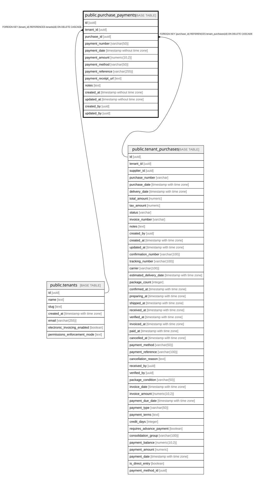

# public.purchase_payments

## Description

Tracking de pagos individuales para órdenes de compra (permite pagos parciales)

## Columns

| Name | Type | Default | Nullable | Children | Parents | Comment |
| ---- | ---- | ------- | -------- | -------- | ------- | ------- |
| id | uuid | gen_random_uuid() | false |  |  |  |
| tenant_id | uuid |  | false |  | [public.tenants](public.tenants.md) |  |
| purchase_id | uuid |  | false |  | [public.tenant_purchases](public.tenant_purchases.md) |  |
| payment_number | varchar(50) |  | false |  |  | Número único del pago (ej: PAY-2025-0001) |
| payment_date | timestamp without time zone | now() | false |  |  |  |
| payment_amount | numeric(10,2) |  | false |  |  | Monto del pago (puede ser parcial) |
| payment_method | varchar(50) |  | true |  |  | Método de pago: transferencia, efectivo, cheque, etc |
| payment_reference | varchar(255) |  | true |  |  | Referencia del pago (número de transacción, cheque, etc) |
| payment_receipt_url | text |  | true |  |  | URL del comprobante de pago en S3 |
| notes | text |  | true |  |  |  |
| created_at | timestamp without time zone | now() | false |  |  |  |
| updated_at | timestamp without time zone | now() | false |  |  |  |
| created_by | uuid |  | true |  |  |  |
| updated_by | uuid |  | true |  |  |  |

## Constraints

| Name | Type | Definition |
| ---- | ---- | ---------- |
| positive_amount | CHECK | CHECK ((payment_amount > (0)::numeric)) |
| purchase_payments_pkey | PRIMARY KEY | PRIMARY KEY (id) |
| purchase_payments_purchase_id_fkey | FOREIGN KEY | FOREIGN KEY (purchase_id) REFERENCES tenant_purchases(id) ON DELETE CASCADE |
| purchase_payments_tenant_id_fkey | FOREIGN KEY | FOREIGN KEY (tenant_id) REFERENCES tenants(id) ON DELETE CASCADE |
| unique_payment_number_per_tenant | UNIQUE | UNIQUE (tenant_id, payment_number) |

## Indexes

| Name | Definition |
| ---- | ---------- |
| purchase_payments_pkey | CREATE UNIQUE INDEX purchase_payments_pkey ON public.purchase_payments USING btree (id) |
| unique_payment_number_per_tenant | CREATE UNIQUE INDEX unique_payment_number_per_tenant ON public.purchase_payments USING btree (tenant_id, payment_number) |
| idx_purchase_payments_date | CREATE INDEX idx_purchase_payments_date ON public.purchase_payments USING btree (payment_date) |
| idx_purchase_payments_purchase | CREATE INDEX idx_purchase_payments_purchase ON public.purchase_payments USING btree (purchase_id) |
| idx_purchase_payments_tenant | CREATE INDEX idx_purchase_payments_tenant ON public.purchase_payments USING btree (tenant_id) |

## Relations

---

> Generated by [tbls](https://github.com/k1LoW/tbls)
