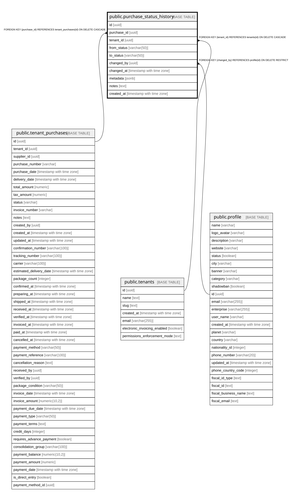

# public.purchase_status_history

## Description

Tracks all status changes for purchase orders with full audit trail

## Columns

| Name | Type | Default | Nullable | Children | Parents | Comment |
| ---- | ---- | ------- | -------- | -------- | ------- | ------- |
| id | uuid | gen_random_uuid() | false |  |  |  |
| purchase_id | uuid |  | false |  | [public.tenant_purchases](public.tenant_purchases.md) |  |
| tenant_id | uuid |  | false |  | [public.tenants](public.tenants.md) |  |
| from_status | varchar(50) |  | true |  |  |  |
| to_status | varchar(50) |  | false |  |  |  |
| changed_by | uuid |  | false |  | [public.profile](public.profile.md) |  |
| changed_at | timestamp with time zone | now() | true |  |  |  |
| metadata | jsonb | '{}'::jsonb | true |  |  | JSONB field for storing state-specific data (tracking numbers, confirmation details, etc.) |
| notes | text |  | true |  |  |  |
| created_at | timestamp with time zone | now() | true |  |  |  |

## Constraints

| Name | Type | Definition |
| ---- | ---- | ---------- |
| chk_valid_status | CHECK | CHECK (((to_status)::text = ANY (ARRAY[('pending'::character varying)::text, ('confirmed'::character varying)::text, ('preparing'::character varying)::text, ('shipped'::character varying)::text, ('partially_received'::character varying)::text, ('received'::character varying)::text, ('verified'::character varying)::text, ('invoiced'::character varying)::text, ('paid'::character varying)::text, ('cancelled'::character varying)::text, ('overdue'::character varying)::text]))) |
| fk_purchase_status_user | FOREIGN KEY | FOREIGN KEY (changed_by) REFERENCES profile(id) ON DELETE RESTRICT |
| purchase_status_history_pkey | PRIMARY KEY | PRIMARY KEY (id) |
| fk_purchase_status_purchase | FOREIGN KEY | FOREIGN KEY (purchase_id) REFERENCES tenant_purchases(id) ON DELETE CASCADE |
| fk_purchase_status_tenant | FOREIGN KEY | FOREIGN KEY (tenant_id) REFERENCES tenants(id) ON DELETE CASCADE |

## Indexes

| Name | Definition |
| ---- | ---------- |
| purchase_status_history_pkey | CREATE UNIQUE INDEX purchase_status_history_pkey ON public.purchase_status_history USING btree (id) |
| idx_purchase_status_history_changed_at | CREATE INDEX idx_purchase_status_history_changed_at ON public.purchase_status_history USING btree (changed_at DESC) |
| idx_purchase_status_history_purchase_id | CREATE INDEX idx_purchase_status_history_purchase_id ON public.purchase_status_history USING btree (purchase_id) |
| idx_purchase_status_history_tenant_id | CREATE INDEX idx_purchase_status_history_tenant_id ON public.purchase_status_history USING btree (tenant_id) |
| idx_purchase_status_history_to_status | CREATE INDEX idx_purchase_status_history_to_status ON public.purchase_status_history USING btree (to_status) |

## Relations

---

> Generated by [tbls](https://github.com/k1LoW/tbls)
