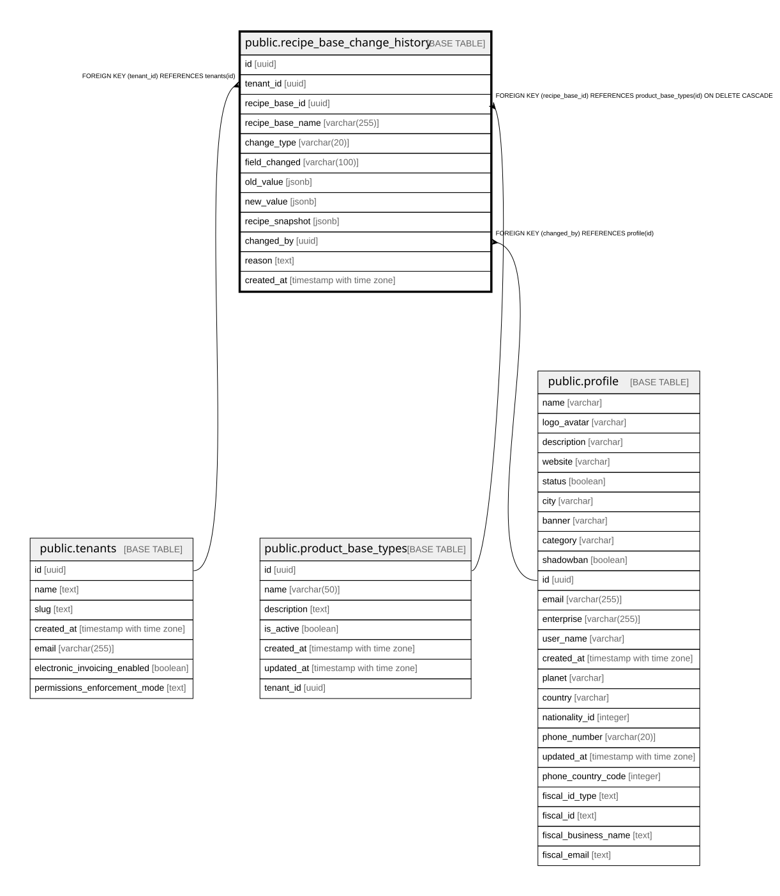

# public.recipe_base_change_history

## Description

Historial de cambios en recetas base para trazabilidad

## Columns

| Name | Type | Default | Nullable | Children | Parents | Comment |
| ---- | ---- | ------- | -------- | -------- | ------- | ------- |
| id | uuid | gen_random_uuid() | false |  |  |  |
| tenant_id | uuid |  | false |  | [public.tenants](public.tenants.md) |  |
| recipe_base_id | uuid |  | false |  | [public.product_base_types](public.product_base_types.md) |  |
| recipe_base_name | varchar(255) |  | false |  |  |  |
| change_type | varchar(20) |  | false |  |  |  |
| field_changed | varchar(100) |  | true |  |  | Campo que cambió: name, description, ingredients, is_active |
| old_value | jsonb |  | true |  |  |  |
| new_value | jsonb |  | true |  |  |  |
| recipe_snapshot | jsonb |  | true |  |  |  |
| changed_by | uuid |  | true |  | [public.profile](public.profile.md) |  |
| reason | text |  | true |  |  |  |
| created_at | timestamp with time zone | now() | true |  |  |  |

## Constraints

| Name | Type | Definition |
| ---- | ---- | ---------- |
| recipe_base_change_history_change_type_check | CHECK | CHECK (((change_type)::text = ANY (ARRAY[('create'::character varying)::text, ('update'::character varying)::text, ('delete'::character varying)::text]))) |
| recipe_base_change_history_recipe_base_id_fkey | FOREIGN KEY | FOREIGN KEY (recipe_base_id) REFERENCES product_base_types(id) ON DELETE CASCADE |
| recipe_base_change_history_changed_by_fkey | FOREIGN KEY | FOREIGN KEY (changed_by) REFERENCES profile(id) |
| recipe_base_change_history_pkey | PRIMARY KEY | PRIMARY KEY (id) |
| recipe_base_change_history_tenant_id_fkey | FOREIGN KEY | FOREIGN KEY (tenant_id) REFERENCES tenants(id) |

## Indexes

| Name | Definition |
| ---- | ---------- |
| recipe_base_change_history_pkey | CREATE UNIQUE INDEX recipe_base_change_history_pkey ON public.recipe_base_change_history USING btree (id) |
| idx_recipe_history_date | CREATE INDEX idx_recipe_history_date ON public.recipe_base_change_history USING btree (created_at) |
| idx_recipe_history_field | CREATE INDEX idx_recipe_history_field ON public.recipe_base_change_history USING btree (field_changed) WHERE (field_changed IS NOT NULL) |
| idx_recipe_history_recipe | CREATE INDEX idx_recipe_history_recipe ON public.recipe_base_change_history USING btree (recipe_base_id) |
| idx_recipe_history_tenant | CREATE INDEX idx_recipe_history_tenant ON public.recipe_base_change_history USING btree (tenant_id) |

## Relations

---

> Generated by [tbls](https://github.com/k1LoW/tbls)
