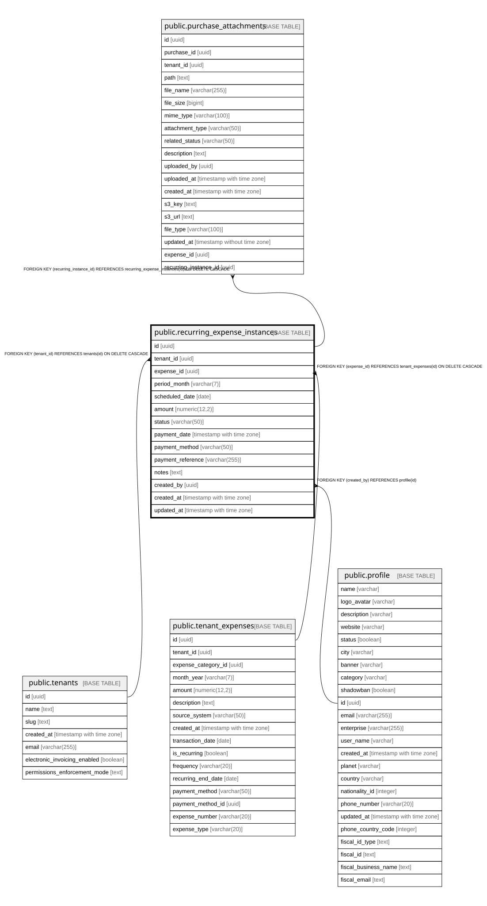

# public.recurring_expense_instances

## Description

Individual payment instances for recurring expenses

## Columns

| Name | Type | Default | Nullable | Children | Parents | Comment |
| ---- | ---- | ------- | -------- | -------- | ------- | ------- |
| id | uuid | gen_random_uuid() | false | [public.purchase_attachments](public.purchase_attachments.md) |  |  |
| tenant_id | uuid |  | false |  | [public.tenants](public.tenants.md) |  |
| expense_id | uuid |  | false |  | [public.tenant_expenses](public.tenant_expenses.md) |  |
| period_month | varchar(7) |  | false |  |  | Period in YYYY-MM format (e.g., 2026-02) |
| scheduled_date | date |  | false |  |  |  |
| amount | numeric(12,2) |  | false |  |  |  |
| status | varchar(50) | 'pending'::character varying | true |  |  | Instance status: pending, paid, skipped, cancelled |
| payment_date | timestamp with time zone |  | true |  |  |  |
| payment_method | varchar(50) |  | true |  |  |  |
| payment_reference | varchar(255) |  | true |  |  |  |
| notes | text |  | true |  |  |  |
| created_by | uuid |  | true |  | [public.profile](public.profile.md) |  |
| created_at | timestamp with time zone | now() | true |  |  |  |
| updated_at | timestamp with time zone | now() | true |  |  |  |

## Constraints

| Name | Type | Definition |
| ---- | ---- | ---------- |
| recurring_expense_instances_created_by_fkey | FOREIGN KEY | FOREIGN KEY (created_by) REFERENCES profile(id) |
| recurring_expense_instances_expense_id_fkey | FOREIGN KEY | FOREIGN KEY (expense_id) REFERENCES tenant_expenses(id) ON DELETE CASCADE |
| recurring_expense_instances_tenant_id_fkey | FOREIGN KEY | FOREIGN KEY (tenant_id) REFERENCES tenants(id) ON DELETE CASCADE |
| recurring_expense_instances_pkey | PRIMARY KEY | PRIMARY KEY (id) |
| recurring_expense_instances_expense_id_period_month_key | UNIQUE | UNIQUE (expense_id, period_month) |

## Indexes

| Name | Definition |
| ---- | ---------- |
| recurring_expense_instances_pkey | CREATE UNIQUE INDEX recurring_expense_instances_pkey ON public.recurring_expense_instances USING btree (id) |
| recurring_expense_instances_expense_id_period_month_key | CREATE UNIQUE INDEX recurring_expense_instances_expense_id_period_month_key ON public.recurring_expense_instances USING btree (expense_id, period_month) |
| idx_recurring_instances_expense | CREATE INDEX idx_recurring_instances_expense ON public.recurring_expense_instances USING btree (expense_id) |
| idx_recurring_instances_tenant | CREATE INDEX idx_recurring_instances_tenant ON public.recurring_expense_instances USING btree (tenant_id) |
| idx_recurring_instances_period | CREATE INDEX idx_recurring_instances_period ON public.recurring_expense_instances USING btree (period_month) |
| idx_recurring_instances_status | CREATE INDEX idx_recurring_instances_status ON public.recurring_expense_instances USING btree (status) |
| idx_recurring_instances_scheduled_date | CREATE INDEX idx_recurring_instances_scheduled_date ON public.recurring_expense_instances USING btree (scheduled_date) |

## Relations

---

> Generated by [tbls](https://github.com/k1LoW/tbls)
