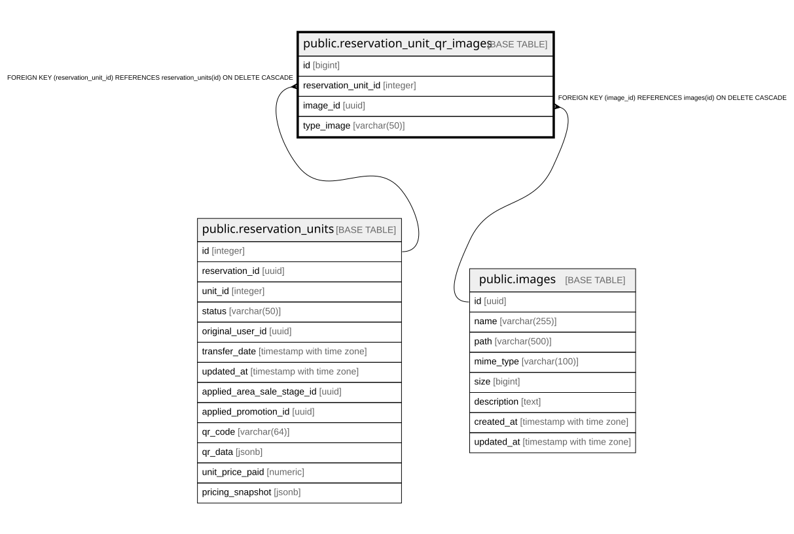

# public.reservation_unit_qr_images

## Columns

| Name | Type | Default | Nullable | Children | Parents | Comment |
| ---- | ---- | ------- | -------- | -------- | ------- | ------- |
| id | bigint | nextval('reservation_unit_qr_images_id_seq'::regclass) | false |  |  |  |
| reservation_unit_id | integer |  | false |  | [public.reservation_units](public.reservation_units.md) |  |
| image_id | uuid |  | false |  | [public.images](public.images.md) |  |
| type_image | varchar(50) |  | false |  |  |  |

## Constraints

| Name | Type | Definition |
| ---- | ---- | ---------- |
| fk_image | FOREIGN KEY | FOREIGN KEY (image_id) REFERENCES images(id) ON DELETE CASCADE |
| reservation_unit_qr_images_pkey | PRIMARY KEY | PRIMARY KEY (id) |
| fk_reservation_unit | FOREIGN KEY | FOREIGN KEY (reservation_unit_id) REFERENCES reservation_units(id) ON DELETE CASCADE |

## Indexes

| Name | Definition |
| ---- | ---------- |
| reservation_unit_qr_images_pkey | CREATE UNIQUE INDEX reservation_unit_qr_images_pkey ON public.reservation_unit_qr_images USING btree (id) |
| idx_reservation_unit_qr_images_image_id | CREATE INDEX idx_reservation_unit_qr_images_image_id ON public.reservation_unit_qr_images USING btree (image_id) |
| idx_reservation_unit_qr_images_reservation_unit_id | CREATE INDEX idx_reservation_unit_qr_images_reservation_unit_id ON public.reservation_unit_qr_images USING btree (reservation_unit_id) |
| idx_reservation_unit_qr_images_type_image | CREATE INDEX idx_reservation_unit_qr_images_type_image ON public.reservation_unit_qr_images USING btree (type_image) |

## Relations

---

> Generated by [tbls](https://github.com/k1LoW/tbls)
