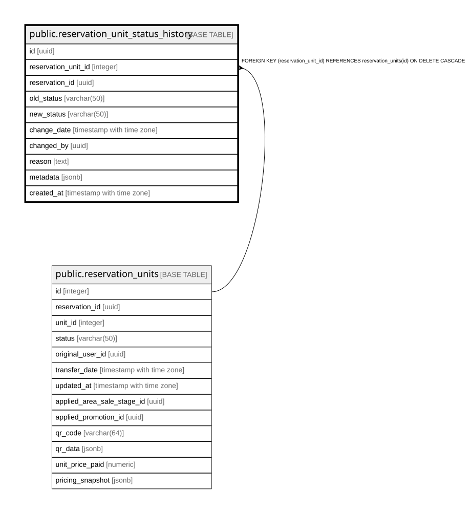

# public.reservation_unit_status_history

## Columns

| Name | Type | Default | Nullable | Children | Parents | Comment |
| ---- | ---- | ------- | -------- | -------- | ------- | ------- |
| id | uuid | gen_random_uuid() | false |  |  |  |
| reservation_unit_id | integer |  | false |  | [public.reservation_units](public.reservation_units.md) |  |
| reservation_id | uuid |  | false |  |  |  |
| old_status | varchar(50) |  | true |  |  |  |
| new_status | varchar(50) |  | false |  |  |  |
| change_date | timestamp with time zone | now() | true |  |  |  |
| changed_by | uuid |  | true |  |  |  |
| reason | text |  | true |  |  |  |
| metadata | jsonb |  | true |  |  |  |
| created_at | timestamp with time zone | now() | true |  |  |  |

## Constraints

| Name | Type | Definition |
| ---- | ---- | ---------- |
| reservation_unit_status_history_reservation_unit_id_fkey | FOREIGN KEY | FOREIGN KEY (reservation_unit_id) REFERENCES reservation_units(id) ON DELETE CASCADE |
| reservation_unit_status_history_pkey | PRIMARY KEY | PRIMARY KEY (id) |

## Indexes

| Name | Definition |
| ---- | ---------- |
| reservation_unit_status_history_pkey | CREATE UNIQUE INDEX reservation_unit_status_history_pkey ON public.reservation_unit_status_history USING btree (id) |
| idx_ru_status_history_unit_id | CREATE INDEX idx_ru_status_history_unit_id ON public.reservation_unit_status_history USING btree (reservation_unit_id) |
| idx_ru_status_history_reservation_id | CREATE INDEX idx_ru_status_history_reservation_id ON public.reservation_unit_status_history USING btree (reservation_id) |

## Relations

---

> Generated by [tbls](https://github.com/k1LoW/tbls)
