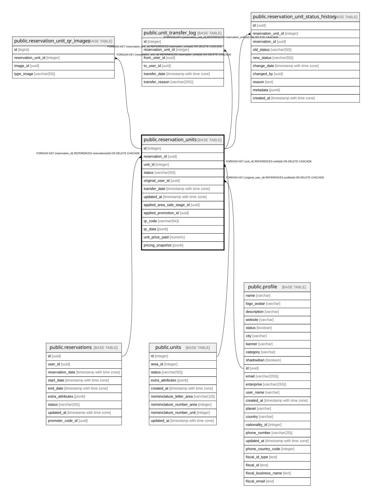

# public.reservation_units

## Columns

| Name | Type | Default | Nullable | Children | Parents | Comment |
| ---- | ---- | ------- | -------- | -------- | ------- | ------- |
| id | integer | nextval('reservation_units_id_seq'::regclass) | false | [public.reservation_unit_qr_images](public.reservation_unit_qr_images.md) [public.unit_transfer_log](public.unit_transfer_log.md) [public.reservation_unit_status_history](public.reservation_unit_status_history.md) |  |  |
| reservation_id | uuid |  | false |  | [public.reservations](public.reservations.md) |  |
| unit_id | integer |  | false |  | [public.units](public.units.md) |  |
| status | varchar(50) | 'reserved'::character varying | true |  |  |  |
| original_user_id | uuid |  | false |  | [public.profile](public.profile.md) |  |
| transfer_date | timestamp with time zone |  | true |  |  |  |
| updated_at | timestamp with time zone | CURRENT_TIMESTAMP | true |  |  |  |
| applied_area_sale_stage_id | uuid |  | true |  |  |  |
| applied_promotion_id | uuid |  | true |  |  |  |
| qr_code | varchar(64) |  | true |  |  |  |
| qr_data | jsonb |  | true |  |  |  |
| unit_price_paid | numeric |  | true |  |  |  |
| pricing_snapshot | jsonb |  | true |  |  |  |

## Constraints

| Name | Type | Definition |
| ---- | ---- | ---------- |
| fk_original_user | FOREIGN KEY | FOREIGN KEY (original_user_id) REFERENCES profile(id) ON DELETE CASCADE |
| reservation_units_pkey | PRIMARY KEY | PRIMARY KEY (id) |
| fk_reservation | FOREIGN KEY | FOREIGN KEY (reservation_id) REFERENCES reservations(id) ON DELETE CASCADE |
| fk_unit | FOREIGN KEY | FOREIGN KEY (unit_id) REFERENCES units(id) ON DELETE CASCADE |
| reservation_units_qr_code_key | UNIQUE | UNIQUE (qr_code) |

## Indexes

| Name | Definition |
| ---- | ---------- |
| reservation_units_pkey | CREATE UNIQUE INDEX reservation_units_pkey ON public.reservation_units USING btree (id) |
| idx_reservation_units_reservation_status | CREATE INDEX idx_reservation_units_reservation_status ON public.reservation_units USING btree (reservation_id, status) |
| idx_reservation_units_status_updated | CREATE INDEX idx_reservation_units_status_updated ON public.reservation_units USING btree (status, updated_at) WHERE ((status)::text = 'reserved'::text) |
| idx_reservation_units_unit_status | CREATE INDEX idx_reservation_units_unit_status ON public.reservation_units USING btree (unit_id, status) |
| reservation_units_qr_code_key | CREATE UNIQUE INDEX reservation_units_qr_code_key ON public.reservation_units USING btree (qr_code) |
| idx_reservation_units_qr_code | CREATE INDEX idx_reservation_units_qr_code ON public.reservation_units USING btree (qr_code) |

## Relations

---

> Generated by [tbls](https://github.com/k1LoW/tbls)
