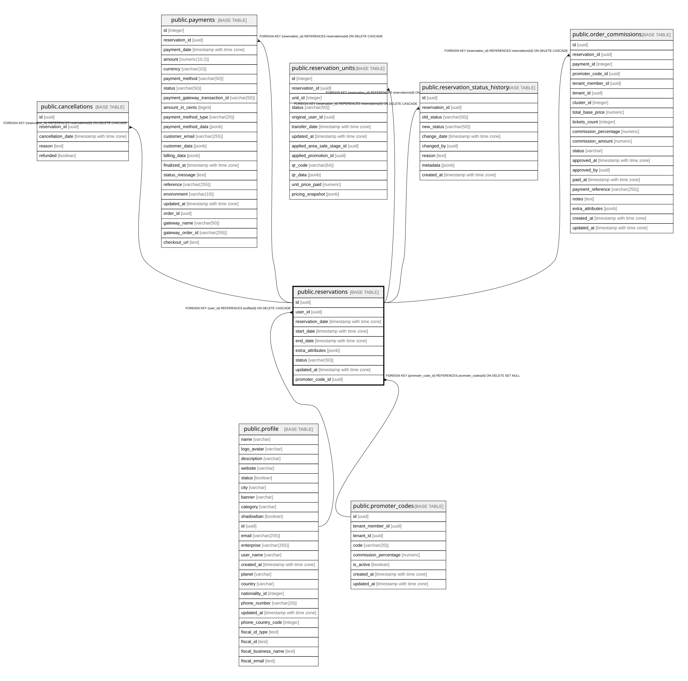

# public.reservations

## Columns

| Name | Type | Default | Nullable | Children | Parents | Comment |
| ---- | ---- | ------- | -------- | -------- | ------- | ------- |
| id | uuid | gen_random_uuid() | false | [public.cancellations](public.cancellations.md) [public.payments](public.payments.md) [public.reservation_units](public.reservation_units.md) [public.reservation_status_history](public.reservation_status_history.md) [public.order_commissions](public.order_commissions.md) |  |  |
| user_id | uuid |  | true |  | [public.profile](public.profile.md) |  |
| reservation_date | timestamp with time zone | CURRENT_TIMESTAMP | true |  |  |  |
| start_date | timestamp with time zone |  | false |  |  |  |
| end_date | timestamp with time zone |  | false |  |  |  |
| extra_attributes | jsonb |  | true |  |  |  |
| status | varchar(50) | 'active'::character varying | true |  |  |  |
| updated_at | timestamp with time zone | now() | true |  |  |  |
| promoter_code_id | uuid |  | true |  | [public.promoter_codes](public.promoter_codes.md) |  |

## Constraints

| Name | Type | Definition |
| ---- | ---- | ---------- |
| fk_user | FOREIGN KEY | FOREIGN KEY (user_id) REFERENCES profile(id) ON DELETE CASCADE |
| reservations_pkey | PRIMARY KEY | PRIMARY KEY (id) |
| reservations_promoter_code_fkey | FOREIGN KEY | FOREIGN KEY (promoter_code_id) REFERENCES promoter_codes(id) ON DELETE SET NULL |

## Indexes

| Name | Definition |
| ---- | ---------- |
| reservations_pkey | CREATE UNIQUE INDEX reservations_pkey ON public.reservations USING btree (id) |
| idx_reservations_status | CREATE INDEX idx_reservations_status ON public.reservations USING btree (status) WHERE ((status)::text = 'pending'::text) |
| idx_reservations_promoter_code | CREATE INDEX idx_reservations_promoter_code ON public.reservations USING btree (promoter_code_id) WHERE (promoter_code_id IS NOT NULL) |

## Relations

---

> Generated by [tbls](https://github.com/k1LoW/tbls)
