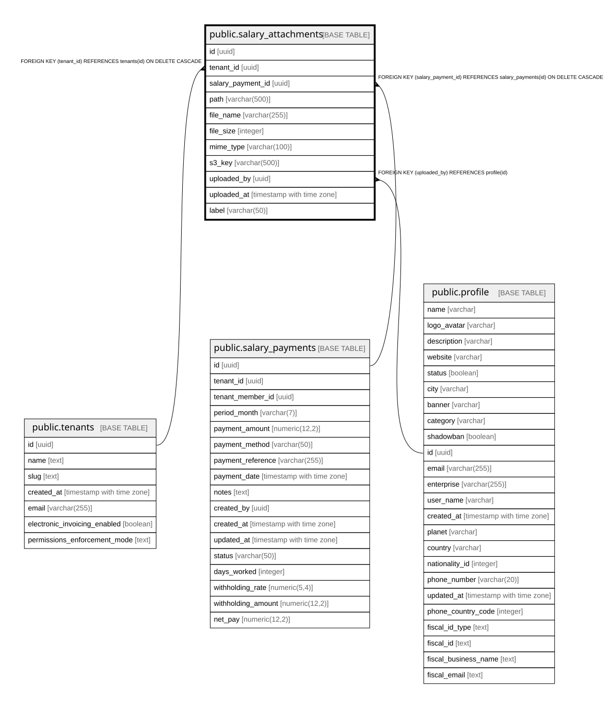

# public.salary_attachments

## Columns

| Name | Type | Default | Nullable | Children | Parents | Comment |
| ---- | ---- | ------- | -------- | -------- | ------- | ------- |
| id | uuid | gen_random_uuid() | false |  |  |  |
| tenant_id | uuid |  | false |  | [public.tenants](public.tenants.md) |  |
| salary_payment_id | uuid |  | false |  | [public.salary_payments](public.salary_payments.md) |  |
| path | varchar(500) |  | false |  |  |  |
| file_name | varchar(255) |  | false |  |  |  |
| file_size | integer |  | true |  |  |  |
| mime_type | varchar(100) |  | true |  |  |  |
| s3_key | varchar(500) |  | true |  |  |  |
| uploaded_by | uuid |  | true |  | [public.profile](public.profile.md) |  |
| uploaded_at | timestamp with time zone | now() | true |  |  |  |
| label | varchar(50) |  | true |  |  |  |

## Constraints

| Name | Type | Definition |
| ---- | ---- | ---------- |
| salary_attachments_uploaded_by_fkey | FOREIGN KEY | FOREIGN KEY (uploaded_by) REFERENCES profile(id) |
| salary_attachments_tenant_id_fkey | FOREIGN KEY | FOREIGN KEY (tenant_id) REFERENCES tenants(id) ON DELETE CASCADE |
| salary_attachments_salary_payment_id_fkey | FOREIGN KEY | FOREIGN KEY (salary_payment_id) REFERENCES salary_payments(id) ON DELETE CASCADE |
| salary_attachments_pkey | PRIMARY KEY | PRIMARY KEY (id) |

## Indexes

| Name | Definition |
| ---- | ---------- |
| salary_attachments_pkey | CREATE UNIQUE INDEX salary_attachments_pkey ON public.salary_attachments USING btree (id) |
| idx_salary_attachments_payment | CREATE INDEX idx_salary_attachments_payment ON public.salary_attachments USING btree (salary_payment_id) |
| idx_salary_attachments_tenant | CREATE INDEX idx_salary_attachments_tenant ON public.salary_attachments USING btree (tenant_id) |
| ix_salary_attachments_label | CREATE INDEX ix_salary_attachments_label ON public.salary_attachments USING btree (label) WHERE (label IS NOT NULL) |

## Relations

---

> Generated by [tbls](https://github.com/k1LoW/tbls)
