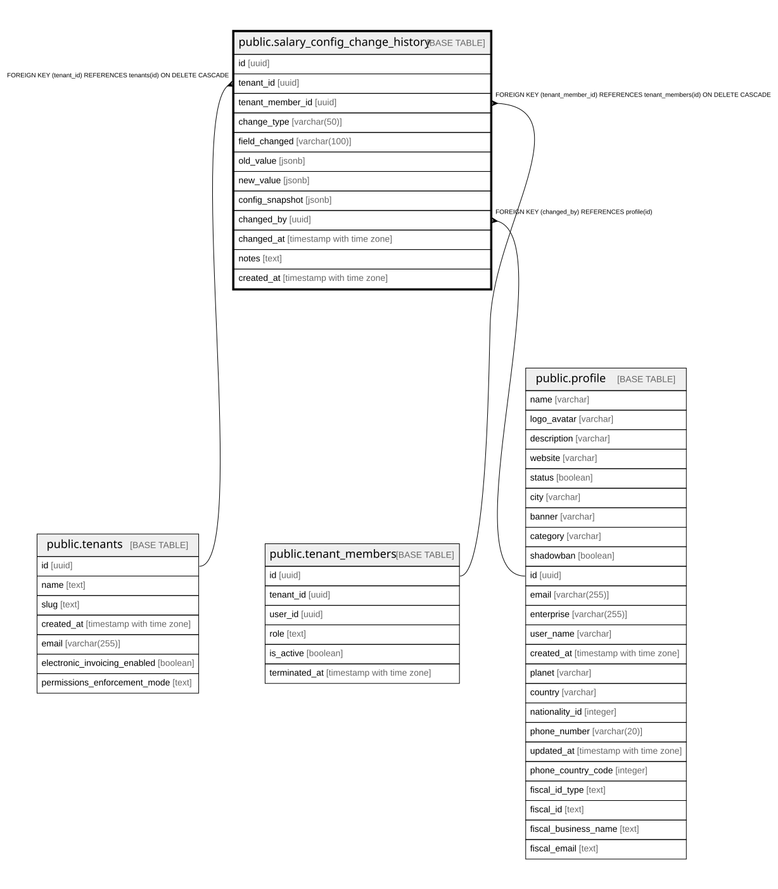

# public.salary_config_change_history

## Description

Audit log for tracking changes to employee salary configuration

## Columns

| Name | Type | Default | Nullable | Children | Parents | Comment |
| ---- | ---- | ------- | -------- | -------- | ------- | ------- |
| id | uuid | gen_random_uuid() | false |  |  |  |
| tenant_id | uuid |  | false |  | [public.tenants](public.tenants.md) |  |
| tenant_member_id | uuid |  | false |  | [public.tenant_members](public.tenant_members.md) |  |
| change_type | varchar(50) |  | false |  |  |  |
| field_changed | varchar(100) |  | true |  |  |  |
| old_value | jsonb |  | true |  |  |  |
| new_value | jsonb |  | true |  |  |  |
| config_snapshot | jsonb |  | true |  |  |  |
| changed_by | uuid |  | true |  | [public.profile](public.profile.md) |  |
| changed_at | timestamp with time zone | now() | true |  |  |  |
| notes | text |  | true |  |  |  |
| created_at | timestamp with time zone | now() | true |  |  |  |

## Constraints

| Name | Type | Definition |
| ---- | ---- | ---------- |
| salary_config_change_history_changed_by_fkey | FOREIGN KEY | FOREIGN KEY (changed_by) REFERENCES profile(id) |
| salary_config_change_history_tenant_member_id_fkey | FOREIGN KEY | FOREIGN KEY (tenant_member_id) REFERENCES tenant_members(id) ON DELETE CASCADE |
| salary_config_change_history_tenant_id_fkey | FOREIGN KEY | FOREIGN KEY (tenant_id) REFERENCES tenants(id) ON DELETE CASCADE |
| salary_config_change_history_pkey | PRIMARY KEY | PRIMARY KEY (id) |

## Indexes

| Name | Definition |
| ---- | ---------- |
| salary_config_change_history_pkey | CREATE UNIQUE INDEX salary_config_change_history_pkey ON public.salary_config_change_history USING btree (id) |
| idx_salary_config_history_tenant_member | CREATE INDEX idx_salary_config_history_tenant_member ON public.salary_config_change_history USING btree (tenant_member_id) |
| idx_salary_config_history_tenant | CREATE INDEX idx_salary_config_history_tenant ON public.salary_config_change_history USING btree (tenant_id) |

## Relations

---

> Generated by [tbls](https://github.com/k1LoW/tbls)
