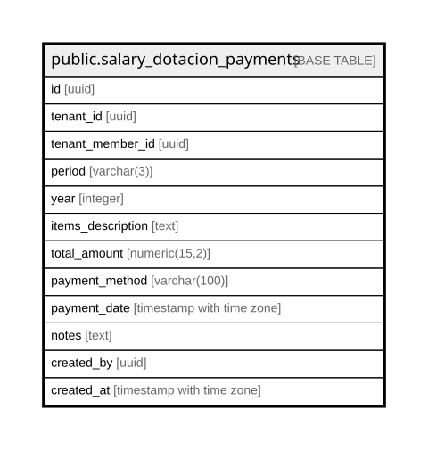

# public.salary_dotacion_payments

## Columns

| Name | Type | Default | Nullable | Children | Parents | Comment |
| ---- | ---- | ------- | -------- | -------- | ------- | ------- |
| id | uuid | gen_random_uuid() | false |  |  |  |
| tenant_id | uuid |  | false |  |  |  |
| tenant_member_id | uuid |  | false |  |  |  |
| period | varchar(3) |  | false |  |  |  |
| year | integer |  | false |  |  |  |
| items_description | text |  | true |  |  |  |
| total_amount | numeric(15,2) |  | false |  |  |  |
| payment_method | varchar(100) |  | true |  |  |  |
| payment_date | timestamp with time zone | now() | false |  |  |  |
| notes | text |  | true |  |  |  |
| created_by | uuid |  | true |  |  |  |
| created_at | timestamp with time zone | now() | false |  |  |  |

## Constraints

| Name | Type | Definition |
| ---- | ---- | ---------- |
| salary_dotacion_payments_period_check | CHECK | CHECK (((period)::text = ANY ((ARRAY['APR'::character varying, 'AUG'::character varying, 'DEC'::character varying])::text[]))) |
| salary_dotacion_payments_total_amount_check | CHECK | CHECK ((total_amount > (0)::numeric)) |
| salary_dotacion_payments_year_check | CHECK | CHECK (((year >= 2000) AND (year <= 2100))) |
| salary_dotacion_payments_pkey | PRIMARY KEY | PRIMARY KEY (id) |
| ux_dotacion_per_period | UNIQUE | UNIQUE (tenant_id, tenant_member_id, period, year) |

## Indexes

| Name | Definition |
| ---- | ---------- |
| salary_dotacion_payments_pkey | CREATE UNIQUE INDEX salary_dotacion_payments_pkey ON public.salary_dotacion_payments USING btree (id) |
| ux_dotacion_per_period | CREATE UNIQUE INDEX ux_dotacion_per_period ON public.salary_dotacion_payments USING btree (tenant_id, tenant_member_id, period, year) |
| idx_dotacion_tenant_member | CREATE INDEX idx_dotacion_tenant_member ON public.salary_dotacion_payments USING btree (tenant_id, tenant_member_id) |

## Relations

---

> Generated by [tbls](https://github.com/k1LoW/tbls)
