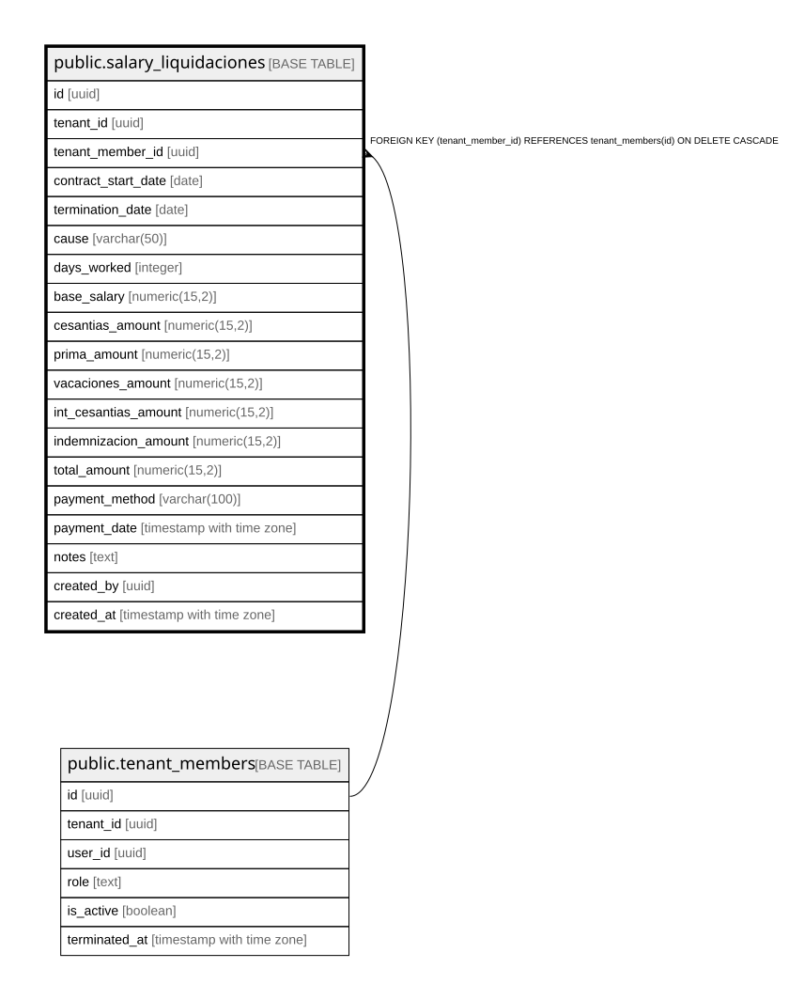

# public.salary_liquidaciones

## Columns

| Name | Type | Default | Nullable | Children | Parents | Comment |
| ---- | ---- | ------- | -------- | -------- | ------- | ------- |
| id | uuid | gen_random_uuid() | false |  |  |  |
| tenant_id | uuid |  | false |  |  |  |
| tenant_member_id | uuid |  | false |  | [public.tenant_members](public.tenant_members.md) |  |
| contract_start_date | date |  | false |  |  |  |
| termination_date | date |  | false |  |  |  |
| cause | varchar(50) |  | false |  |  |  |
| days_worked | integer |  | false |  |  |  |
| base_salary | numeric(15,2) |  | false |  |  |  |
| cesantias_amount | numeric(15,2) | 0 | false |  |  |  |
| prima_amount | numeric(15,2) | 0 | false |  |  |  |
| vacaciones_amount | numeric(15,2) | 0 | false |  |  |  |
| int_cesantias_amount | numeric(15,2) | 0 | false |  |  |  |
| indemnizacion_amount | numeric(15,2) | 0 | false |  |  |  |
| total_amount | numeric(15,2) |  | false |  |  |  |
| payment_method | varchar(100) |  | true |  |  |  |
| payment_date | timestamp with time zone | now() | false |  |  |  |
| notes | text |  | true |  |  |  |
| created_by | uuid |  | true |  |  |  |
| created_at | timestamp with time zone | now() | false |  |  |  |

## Constraints

| Name | Type | Definition |
| ---- | ---- | ---------- |
| salary_liquidaciones_base_salary_check | CHECK | CHECK ((base_salary > (0)::numeric)) |
| salary_liquidaciones_cause_check | CHECK | CHECK (((cause)::text = ANY ((ARRAY['sin_justa_causa'::character varying, 'justa_causa'::character varying, 'renuncia'::character varying])::text[]))) |
| salary_liquidaciones_cesantias_amount_check | CHECK | CHECK ((cesantias_amount >= (0)::numeric)) |
| salary_liquidaciones_days_worked_check | CHECK | CHECK ((days_worked > 0)) |
| salary_liquidaciones_indemnizacion_amount_check | CHECK | CHECK ((indemnizacion_amount >= (0)::numeric)) |
| salary_liquidaciones_int_cesantias_amount_check | CHECK | CHECK ((int_cesantias_amount >= (0)::numeric)) |
| salary_liquidaciones_prima_amount_check | CHECK | CHECK ((prima_amount >= (0)::numeric)) |
| salary_liquidaciones_total_amount_check | CHECK | CHECK ((total_amount > (0)::numeric)) |
| salary_liquidaciones_vacaciones_amount_check | CHECK | CHECK ((vacaciones_amount >= (0)::numeric)) |
| salary_liquidaciones_tenant_member_id_fkey | FOREIGN KEY | FOREIGN KEY (tenant_member_id) REFERENCES tenant_members(id) ON DELETE CASCADE |
| salary_liquidaciones_pkey | PRIMARY KEY | PRIMARY KEY (id) |
| salary_liquidaciones_tenant_member_id_key | UNIQUE | UNIQUE (tenant_member_id) |

## Indexes

| Name | Definition |
| ---- | ---------- |
| salary_liquidaciones_pkey | CREATE UNIQUE INDEX salary_liquidaciones_pkey ON public.salary_liquidaciones USING btree (id) |
| salary_liquidaciones_tenant_member_id_key | CREATE UNIQUE INDEX salary_liquidaciones_tenant_member_id_key ON public.salary_liquidaciones USING btree (tenant_member_id) |
| idx_salary_liquidaciones_tenant_member | CREATE INDEX idx_salary_liquidaciones_tenant_member ON public.salary_liquidaciones USING btree (tenant_id, tenant_member_id) |

## Relations

---

> Generated by [tbls](https://github.com/k1LoW/tbls)
