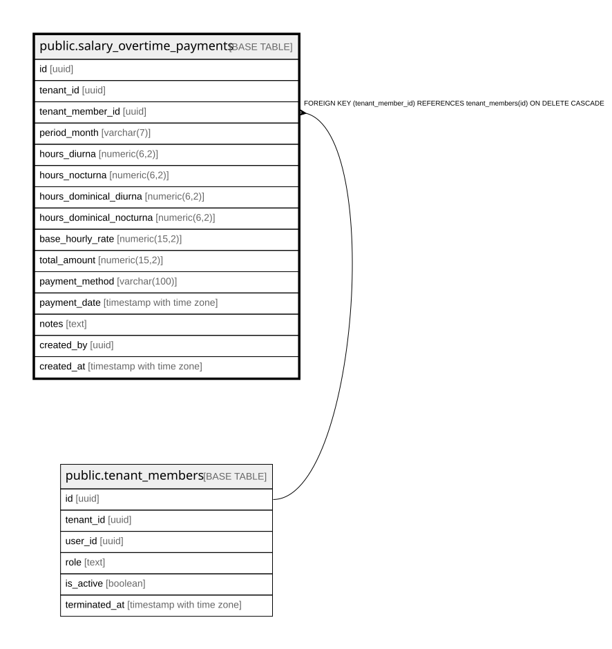

# public.salary_overtime_payments

## Columns

| Name | Type | Default | Nullable | Children | Parents | Comment |
| ---- | ---- | ------- | -------- | -------- | ------- | ------- |
| id | uuid | gen_random_uuid() | false |  |  |  |
| tenant_id | uuid |  | false |  |  |  |
| tenant_member_id | uuid |  | false |  | [public.tenant_members](public.tenant_members.md) |  |
| period_month | varchar(7) |  | false |  |  |  |
| hours_diurna | numeric(6,2) | 0 | false |  |  |  |
| hours_nocturna | numeric(6,2) | 0 | false |  |  |  |
| hours_dominical_diurna | numeric(6,2) | 0 | false |  |  |  |
| hours_dominical_nocturna | numeric(6,2) | 0 | false |  |  |  |
| base_hourly_rate | numeric(15,2) |  | false |  |  |  |
| total_amount | numeric(15,2) |  | false |  |  |  |
| payment_method | varchar(100) |  | true |  |  |  |
| payment_date | timestamp with time zone | now() | false |  |  |  |
| notes | text |  | true |  |  |  |
| created_by | uuid |  | true |  |  |  |
| created_at | timestamp with time zone | now() | false |  |  |  |

## Constraints

| Name | Type | Definition |
| ---- | ---- | ---------- |
| salary_overtime_payments_base_hourly_rate_check | CHECK | CHECK ((base_hourly_rate > (0)::numeric)) |
| salary_overtime_payments_hours_diurna_check | CHECK | CHECK ((hours_diurna >= (0)::numeric)) |
| salary_overtime_payments_hours_dominical_diurna_check | CHECK | CHECK ((hours_dominical_diurna >= (0)::numeric)) |
| salary_overtime_payments_hours_dominical_nocturna_check | CHECK | CHECK ((hours_dominical_nocturna >= (0)::numeric)) |
| salary_overtime_payments_hours_nocturna_check | CHECK | CHECK ((hours_nocturna >= (0)::numeric)) |
| salary_overtime_payments_total_amount_check | CHECK | CHECK ((total_amount > (0)::numeric)) |
| salary_overtime_payments_tenant_member_id_fkey | FOREIGN KEY | FOREIGN KEY (tenant_member_id) REFERENCES tenant_members(id) ON DELETE CASCADE |
| salary_overtime_payments_pkey | PRIMARY KEY | PRIMARY KEY (id) |

## Indexes

| Name | Definition |
| ---- | ---------- |
| salary_overtime_payments_pkey | CREATE UNIQUE INDEX salary_overtime_payments_pkey ON public.salary_overtime_payments USING btree (id) |
| idx_overtime_payments_member_period | CREATE INDEX idx_overtime_payments_member_period ON public.salary_overtime_payments USING btree (tenant_id, tenant_member_id, period_month) |

## Relations

---

> Generated by [tbls](https://github.com/k1LoW/tbls)
