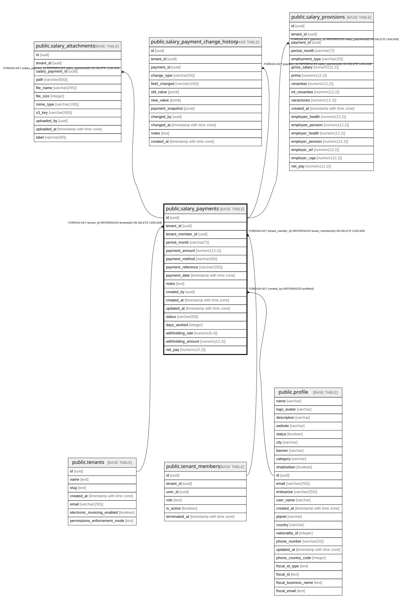

# public.salary_payments

## Columns

| Name | Type | Default | Nullable | Children | Parents | Comment |
| ---- | ---- | ------- | -------- | -------- | ------- | ------- |
| id | uuid | gen_random_uuid() | false | [public.salary_attachments](public.salary_attachments.md) [public.salary_payment_change_history](public.salary_payment_change_history.md) [public.salary_provisions](public.salary_provisions.md) |  |  |
| tenant_id | uuid |  | false |  | [public.tenants](public.tenants.md) |  |
| tenant_member_id | uuid |  | false |  | [public.tenant_members](public.tenant_members.md) |  |
| period_month | varchar(7) |  | false |  |  |  |
| payment_amount | numeric(12,2) |  | false |  |  |  |
| payment_method | varchar(50) |  | true |  |  |  |
| payment_reference | varchar(255) |  | true |  |  |  |
| payment_date | timestamp with time zone |  | false |  |  |  |
| notes | text |  | true |  |  |  |
| created_by | uuid |  | true |  | [public.profile](public.profile.md) |  |
| created_at | timestamp with time zone | now() | true |  |  |  |
| updated_at | timestamp with time zone | now() | true |  |  |  |
| status | varchar(50) | 'paid'::character varying | true |  |  | Payment status: pending, paid, cancelled |
| days_worked | integer |  | true |  |  |  |
| withholding_rate | numeric(5,4) | NULL::numeric | true |  |  |  |
| withholding_amount | numeric(12,2) | NULL::numeric | true |  |  |  |
| net_pay | numeric(12,2) |  | true |  |  |  |

## Constraints

| Name | Type | Definition |
| ---- | ---- | ---------- |
| salary_payments_created_by_fkey | FOREIGN KEY | FOREIGN KEY (created_by) REFERENCES profile(id) |
| salary_payments_tenant_member_id_fkey | FOREIGN KEY | FOREIGN KEY (tenant_member_id) REFERENCES tenant_members(id) ON DELETE CASCADE |
| salary_payments_tenant_id_fkey | FOREIGN KEY | FOREIGN KEY (tenant_id) REFERENCES tenants(id) ON DELETE CASCADE |
| salary_payments_pkey | PRIMARY KEY | PRIMARY KEY (id) |

## Indexes

| Name | Definition |
| ---- | ---------- |
| salary_payments_pkey | CREATE UNIQUE INDEX salary_payments_pkey ON public.salary_payments USING btree (id) |
| idx_salary_payments_tenant | CREATE INDEX idx_salary_payments_tenant ON public.salary_payments USING btree (tenant_id) |
| idx_salary_payments_member | CREATE INDEX idx_salary_payments_member ON public.salary_payments USING btree (tenant_member_id) |
| idx_salary_payments_period | CREATE INDEX idx_salary_payments_period ON public.salary_payments USING btree (period_month) |
| idx_salary_payments_date | CREATE INDEX idx_salary_payments_date ON public.salary_payments USING btree (payment_date) |
| idx_salary_payments_status | CREATE INDEX idx_salary_payments_status ON public.salary_payments USING btree (status) |
| idx_salary_payments_withholding | CREATE INDEX idx_salary_payments_withholding ON public.salary_payments USING btree (tenant_id) WHERE (withholding_amount IS NOT NULL) |

## Relations

---

> Generated by [tbls](https://github.com/k1LoW/tbls)
