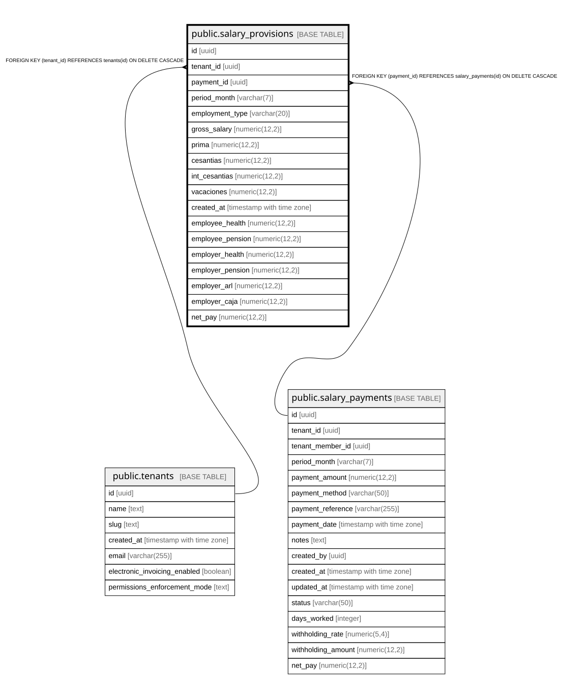

# public.salary_provisions

## Columns

| Name | Type | Default | Nullable | Children | Parents | Comment |
| ---- | ---- | ------- | -------- | -------- | ------- | ------- |
| id | uuid | gen_random_uuid() | false |  |  |  |
| tenant_id | uuid |  | false |  | [public.tenants](public.tenants.md) |  |
| payment_id | uuid |  | false |  | [public.salary_payments](public.salary_payments.md) |  |
| period_month | varchar(7) |  | false |  |  |  |
| employment_type | varchar(20) |  | false |  |  |  |
| gross_salary | numeric(12,2) |  | false |  |  |  |
| prima | numeric(12,2) |  | false |  |  |  |
| cesantias | numeric(12,2) |  | false |  |  |  |
| int_cesantias | numeric(12,2) |  | false |  |  |  |
| vacaciones | numeric(12,2) |  | false |  |  |  |
| created_at | timestamp with time zone | now() | false |  |  |  |
| employee_health | numeric(12,2) | 0 | false |  |  |  |
| employee_pension | numeric(12,2) | 0 | false |  |  |  |
| employer_health | numeric(12,2) | 0 | false |  |  |  |
| employer_pension | numeric(12,2) | 0 | false |  |  |  |
| employer_arl | numeric(12,2) | 0 | false |  |  |  |
| employer_caja | numeric(12,2) | 0 | false |  |  |  |
| net_pay | numeric(12,2) |  | true |  |  |  |

## Constraints

| Name | Type | Definition |
| ---- | ---- | ---------- |
| salary_provisions_tenant_id_fkey | FOREIGN KEY | FOREIGN KEY (tenant_id) REFERENCES tenants(id) ON DELETE CASCADE |
| salary_provisions_payment_id_fkey | FOREIGN KEY | FOREIGN KEY (payment_id) REFERENCES salary_payments(id) ON DELETE CASCADE |
| salary_provisions_pkey | PRIMARY KEY | PRIMARY KEY (id) |

## Indexes

| Name | Definition |
| ---- | ---------- |
| salary_provisions_pkey | CREATE UNIQUE INDEX salary_provisions_pkey ON public.salary_provisions USING btree (id) |
| ux_salary_provisions_payment | CREATE UNIQUE INDEX ux_salary_provisions_payment ON public.salary_provisions USING btree (payment_id) |
| idx_salary_provisions_tenant_period | CREATE INDEX idx_salary_provisions_tenant_period ON public.salary_provisions USING btree (tenant_id, period_month) |

## Relations

---

> Generated by [tbls](https://github.com/k1LoW/tbls)
