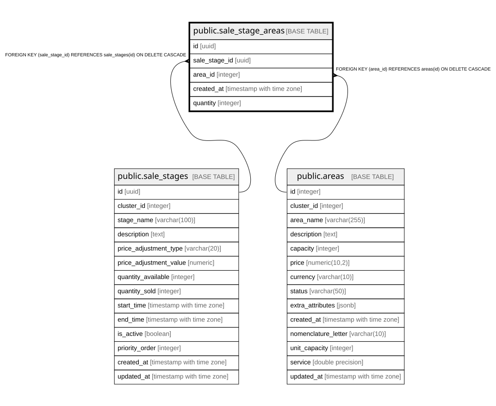

# public.sale_stage_areas

## Columns

| Name | Type | Default | Nullable | Children | Parents | Comment |
| ---- | ---- | ------- | -------- | -------- | ------- | ------- |
| id | uuid | gen_random_uuid() | false |  |  |  |
| sale_stage_id | uuid |  | false |  | [public.sale_stages](public.sale_stages.md) |  |
| area_id | integer |  | false |  | [public.areas](public.areas.md) |  |
| created_at | timestamp with time zone | now() | false |  |  |  |
| quantity | integer | 1 | true |  |  |  |

## Constraints

| Name | Type | Definition |
| ---- | ---- | ---------- |
| sale_stage_areas_area_id_fkey | FOREIGN KEY | FOREIGN KEY (area_id) REFERENCES areas(id) ON DELETE CASCADE |
| sale_stage_areas_sale_stage_id_fkey | FOREIGN KEY | FOREIGN KEY (sale_stage_id) REFERENCES sale_stages(id) ON DELETE CASCADE |
| sale_stage_areas_pkey | PRIMARY KEY | PRIMARY KEY (id) |
| sale_stage_areas_sale_stage_id_area_id_key | UNIQUE | UNIQUE (sale_stage_id, area_id) |

## Indexes

| Name | Definition |
| ---- | ---------- |
| sale_stage_areas_pkey | CREATE UNIQUE INDEX sale_stage_areas_pkey ON public.sale_stage_areas USING btree (id) |
| sale_stage_areas_sale_stage_id_area_id_key | CREATE UNIQUE INDEX sale_stage_areas_sale_stage_id_area_id_key ON public.sale_stage_areas USING btree (sale_stage_id, area_id) |
| idx_sale_stage_areas_stage | CREATE INDEX idx_sale_stage_areas_stage ON public.sale_stage_areas USING btree (sale_stage_id) |
| idx_sale_stage_areas_area | CREATE INDEX idx_sale_stage_areas_area ON public.sale_stage_areas USING btree (area_id) |

## Relations

---

> Generated by [tbls](https://github.com/k1LoW/tbls)
