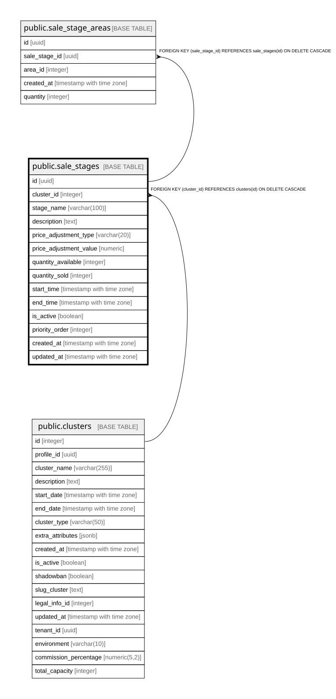

# public.sale_stages

## Columns

| Name | Type | Default | Nullable | Children | Parents | Comment |
| ---- | ---- | ------- | -------- | -------- | ------- | ------- |
| id | uuid | gen_random_uuid() | false | [public.sale_stage_areas](public.sale_stage_areas.md) |  |  |
| cluster_id | integer |  | false |  | [public.clusters](public.clusters.md) |  |
| stage_name | varchar(100) |  | false |  |  |  |
| description | text |  | true |  |  |  |
| price_adjustment_type | varchar(20) |  | false |  |  |  |
| price_adjustment_value | numeric |  | false |  |  |  |
| quantity_available | integer | 0 | false |  |  |  |
| quantity_sold | integer | 0 | false |  |  |  |
| start_time | timestamp with time zone |  | false |  |  |  |
| end_time | timestamp with time zone |  | true |  |  |  |
| is_active | boolean | true | false |  |  |  |
| priority_order | integer | 0 | false |  |  |  |
| created_at | timestamp with time zone | now() | false |  |  |  |
| updated_at | timestamp with time zone | now() | false |  |  |  |

## Constraints

| Name | Type | Definition |
| ---- | ---- | ---------- |
| sale_stages_price_adjustment_type_check | CHECK | CHECK (((price_adjustment_type)::text = ANY ((ARRAY['percentage'::character varying, 'fixed'::character varying, 'fixed_price'::character varying])::text[]))) |
| sale_stages_cluster_id_fkey | FOREIGN KEY | FOREIGN KEY (cluster_id) REFERENCES clusters(id) ON DELETE CASCADE |
| sale_stages_pkey | PRIMARY KEY | PRIMARY KEY (id) |

## Indexes

| Name | Definition |
| ---- | ---------- |
| sale_stages_pkey | CREATE UNIQUE INDEX sale_stages_pkey ON public.sale_stages USING btree (id) |
| idx_sale_stages_cluster | CREATE INDEX idx_sale_stages_cluster ON public.sale_stages USING btree (cluster_id) |
| idx_sale_stages_active | CREATE INDEX idx_sale_stages_active ON public.sale_stages USING btree (cluster_id, is_active) WHERE (is_active = true) |

## Relations

---

> Generated by [tbls](https://github.com/k1LoW/tbls)
