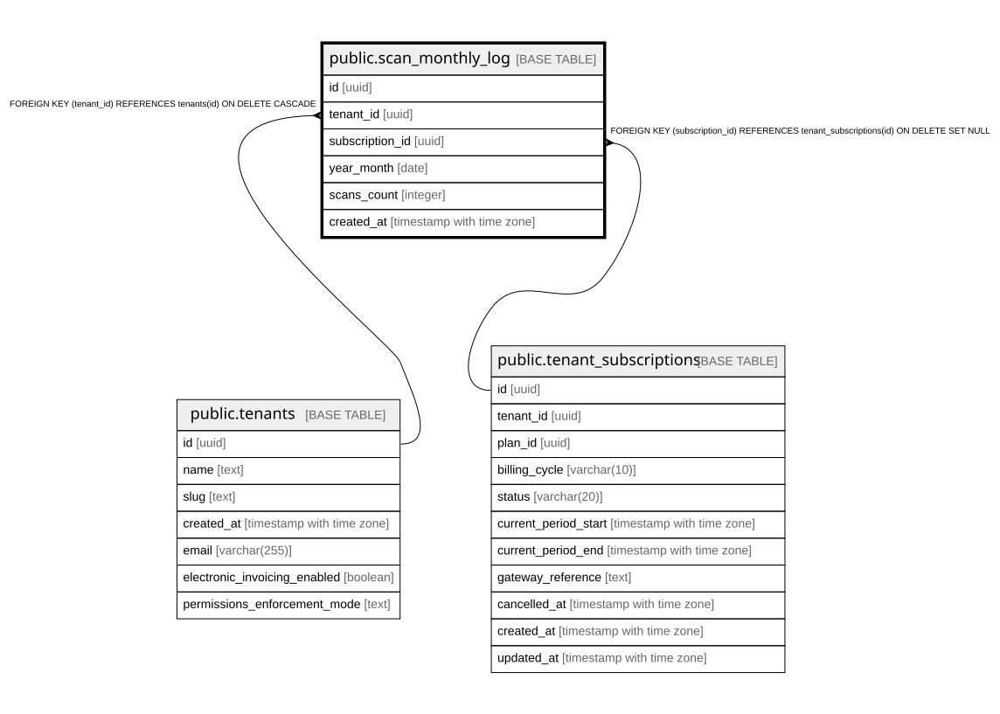

# public.scan_monthly_log

## Columns

| Name | Type | Default | Nullable | Children | Parents | Comment |
| ---- | ---- | ------- | -------- | -------- | ------- | ------- |
| id | uuid | gen_random_uuid() | false |  |  |  |
| tenant_id | uuid |  | false |  | [public.tenants](public.tenants.md) |  |
| subscription_id | uuid |  | true |  | [public.tenant_subscriptions](public.tenant_subscriptions.md) |  |
| year_month | date |  | false |  |  |  |
| scans_count | integer | 0 | false |  |  |  |
| created_at | timestamp with time zone | now() | true |  |  |  |

## Constraints

| Name | Type | Definition |
| ---- | ---- | ---------- |
| scan_monthly_log_tenant_id_fkey | FOREIGN KEY | FOREIGN KEY (tenant_id) REFERENCES tenants(id) ON DELETE CASCADE |
| scan_monthly_log_subscription_id_fkey | FOREIGN KEY | FOREIGN KEY (subscription_id) REFERENCES tenant_subscriptions(id) ON DELETE SET NULL |
| scan_monthly_log_pkey | PRIMARY KEY | PRIMARY KEY (id) |
| scan_monthly_log_tenant_id_year_month_key | UNIQUE | UNIQUE (tenant_id, year_month) |

## Indexes

| Name | Definition |
| ---- | ---------- |
| scan_monthly_log_pkey | CREATE UNIQUE INDEX scan_monthly_log_pkey ON public.scan_monthly_log USING btree (id) |
| scan_monthly_log_tenant_id_year_month_key | CREATE UNIQUE INDEX scan_monthly_log_tenant_id_year_month_key ON public.scan_monthly_log USING btree (tenant_id, year_month) |
| idx_scan_monthly_log_tenant | CREATE INDEX idx_scan_monthly_log_tenant ON public.scan_monthly_log USING btree (tenant_id, year_month DESC) |

## Relations

---

> Generated by [tbls](https://github.com/k1LoW/tbls)
