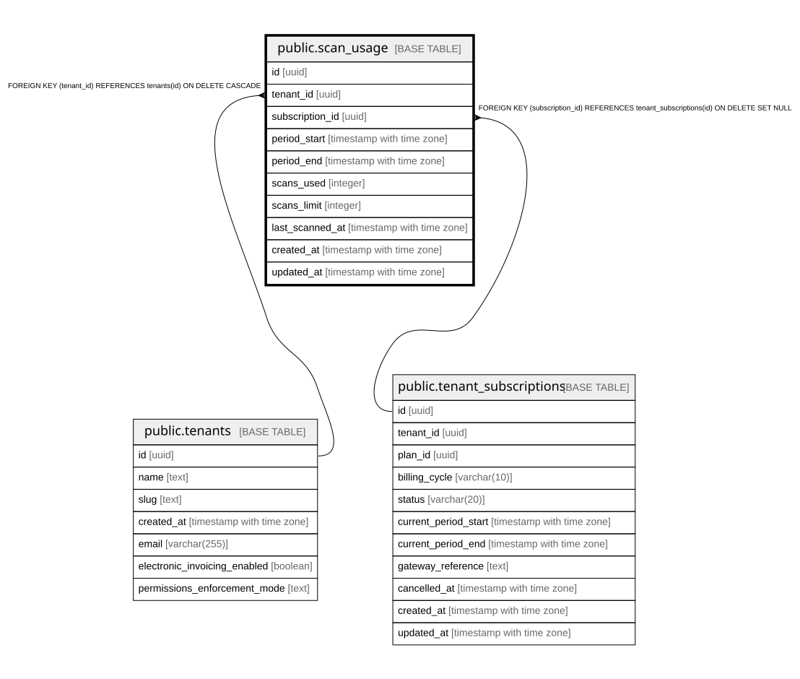

# public.scan_usage

## Columns

| Name | Type | Default | Nullable | Children | Parents | Comment |
| ---- | ---- | ------- | -------- | -------- | ------- | ------- |
| id | uuid | gen_random_uuid() | false |  |  |  |
| tenant_id | uuid |  | false |  | [public.tenants](public.tenants.md) |  |
| subscription_id | uuid |  | true |  | [public.tenant_subscriptions](public.tenant_subscriptions.md) |  |
| period_start | timestamp with time zone |  | false |  |  |  |
| period_end | timestamp with time zone |  | false |  |  |  |
| scans_used | integer | 0 | false |  |  |  |
| scans_limit | integer | 1000 | false |  |  |  |
| last_scanned_at | timestamp with time zone |  | true |  |  |  |
| created_at | timestamp with time zone | now() | true |  |  |  |
| updated_at | timestamp with time zone | now() | true |  |  |  |

## Constraints

| Name | Type | Definition |
| ---- | ---- | ---------- |
| scan_usage_tenant_id_fkey | FOREIGN KEY | FOREIGN KEY (tenant_id) REFERENCES tenants(id) ON DELETE CASCADE |
| scan_usage_subscription_id_fkey | FOREIGN KEY | FOREIGN KEY (subscription_id) REFERENCES tenant_subscriptions(id) ON DELETE SET NULL |
| scan_usage_pkey | PRIMARY KEY | PRIMARY KEY (id) |
| scan_usage_tenant_id_period_start_key | UNIQUE | UNIQUE (tenant_id, period_start) |

## Indexes

| Name | Definition |
| ---- | ---------- |
| scan_usage_pkey | CREATE UNIQUE INDEX scan_usage_pkey ON public.scan_usage USING btree (id) |
| scan_usage_tenant_id_period_start_key | CREATE UNIQUE INDEX scan_usage_tenant_id_period_start_key ON public.scan_usage USING btree (tenant_id, period_start) |
| idx_scan_usage_tenant_period | CREATE INDEX idx_scan_usage_tenant_period ON public.scan_usage USING btree (tenant_id, period_start DESC) |
| idx_scan_usage_subscription | CREATE INDEX idx_scan_usage_subscription ON public.scan_usage USING btree (subscription_id) |

## Relations

---

> Generated by [tbls](https://github.com/k1LoW/tbls)
