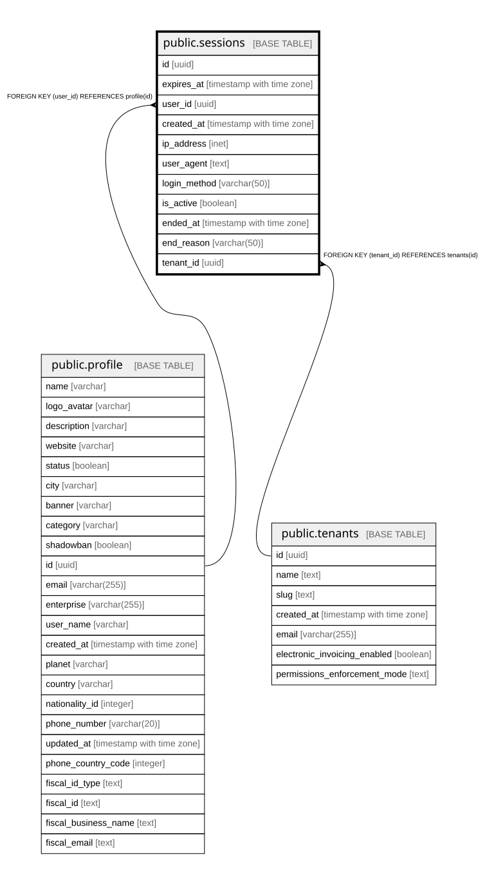

# public.sessions

## Columns

| Name | Type | Default | Nullable | Children | Parents | Comment |
| ---- | ---- | ------- | -------- | -------- | ------- | ------- |
| id | uuid |  | false |  |  |  |
| expires_at | timestamp with time zone |  | false |  |  |  |
| user_id | uuid |  | false |  | [public.profile](public.profile.md) |  |
| created_at | timestamp with time zone | now() | true |  |  | When the session was created |
| ip_address | inet |  | true |  |  | IP address where session was created |
| user_agent | text |  | true |  |  | User agent string from login |
| login_method | varchar(50) | 'magic_link'::character varying | true |  |  | How user logged in (magic_link, etc) |
| is_active | boolean | true | true |  |  | Whether session is currently active |
| ended_at | timestamp with time zone |  | true |  |  | When session was ended |
| end_reason | varchar(50) | NULL::character varying | true |  |  | Why session ended (logout, expired, forced) |
| tenant_id | uuid |  | true |  | [public.tenants](public.tenants.md) |  |

## Constraints

| Name | Type | Definition |
| ---- | ---- | ---------- |
| sessions_user_id_profile_id_fk | FOREIGN KEY | FOREIGN KEY (user_id) REFERENCES profile(id) |
| sessions_tenant_id_fkey | FOREIGN KEY | FOREIGN KEY (tenant_id) REFERENCES tenants(id) |
| sessions_pkey | PRIMARY KEY | PRIMARY KEY (id) |

## Indexes

| Name | Definition |
| ---- | ---------- |
| idx_sessions_is_active | CREATE INDEX idx_sessions_is_active ON public.sessions USING btree (is_active) |
| sessions_pkey | CREATE UNIQUE INDEX sessions_pkey ON public.sessions USING btree (id) |
| idx_sessions_user_id | CREATE INDEX idx_sessions_user_id ON public.sessions USING btree (user_id) |

## Relations

---

> Generated by [tbls](https://github.com/k1LoW/tbls)
