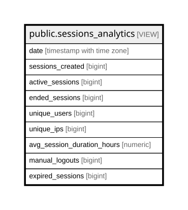

# public.sessions_analytics

## Description

Daily analytics for user sessions and activity

<details>
<summary><strong>Table Definition</strong></summary>

```sql
CREATE VIEW sessions_analytics AS (
 SELECT date_trunc('day'::text, created_at) AS date,
    count(*) AS sessions_created,
    count(
        CASE
            WHEN (is_active = true) THEN 1
            ELSE NULL::integer
        END) AS active_sessions,
    count(
        CASE
            WHEN (ended_at IS NOT NULL) THEN 1
            ELSE NULL::integer
        END) AS ended_sessions,
    count(DISTINCT user_id) AS unique_users,
    count(DISTINCT ip_address) AS unique_ips,
    avg((EXTRACT(epoch FROM (COALESCE(ended_at, now()) - created_at)) / (3600)::numeric)) AS avg_session_duration_hours,
    count(
        CASE
            WHEN ((end_reason)::text = 'logout'::text) THEN 1
            ELSE NULL::integer
        END) AS manual_logouts,
    count(
        CASE
            WHEN ((end_reason)::text = 'expired'::text) THEN 1
            ELSE NULL::integer
        END) AS expired_sessions
   FROM sessions
  GROUP BY (date_trunc('day'::text, created_at))
  ORDER BY (date_trunc('day'::text, created_at)) DESC
)
```

</details>

## Columns

| Name | Type | Default | Nullable | Children | Parents | Comment |
| ---- | ---- | ------- | -------- | -------- | ------- | ------- |
| date | timestamp with time zone |  | true |  |  |  |
| sessions_created | bigint |  | true |  |  |  |
| active_sessions | bigint |  | true |  |  |  |
| ended_sessions | bigint |  | true |  |  |  |
| unique_users | bigint |  | true |  |  |  |
| unique_ips | bigint |  | true |  |  |  |
| avg_session_duration_hours | numeric |  | true |  |  |  |
| manual_logouts | bigint |  | true |  |  |  |
| expired_sessions | bigint |  | true |  |  |  |

## Referenced Tables

| Name | Columns | Comment | Type |
| ---- | ------- | ------- | ---- |
| [COALESCE](COALESCE.md) | 0 |  |  |
| [public.sessions](public.sessions.md) | 11 |  | BASE TABLE |

## Relations



---

> Generated by [tbls](https://github.com/k1LoW/tbls)
