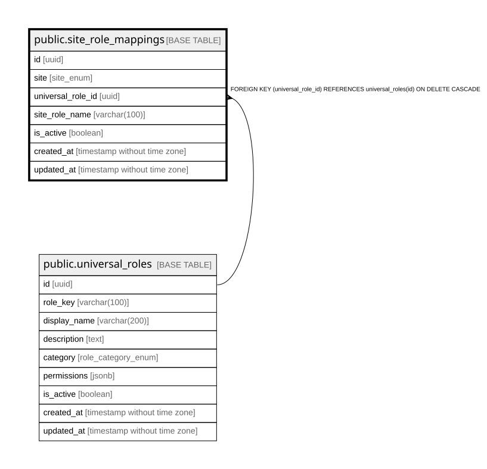

# public.site_role_mappings

## Columns

| Name | Type | Default | Nullable | Children | Parents | Comment |
| ---- | ---- | ------- | -------- | -------- | ------- | ------- |
| id | uuid | gen_random_uuid() | false |  |  |  |
| site | site_enum |  | false |  |  |  |
| universal_role_id | uuid |  | false |  | [public.universal_roles](public.universal_roles.md) |  |
| site_role_name | varchar(100) |  | false |  |  |  |
| is_active | boolean | true | true |  |  |  |
| created_at | timestamp without time zone | now() | true |  |  |  |
| updated_at | timestamp without time zone | now() | true |  |  |  |

## Constraints

| Name | Type | Definition |
| ---- | ---- | ---------- |
| site_role_mappings_pkey | PRIMARY KEY | PRIMARY KEY (id) |
| unique_site_role_name | UNIQUE | UNIQUE (site, site_role_name) |
| unique_universal_role_per_site | UNIQUE | UNIQUE (site, universal_role_id) |
| site_role_mappings_universal_role_id_fkey | FOREIGN KEY | FOREIGN KEY (universal_role_id) REFERENCES universal_roles(id) ON DELETE CASCADE |

## Indexes

| Name | Definition |
| ---- | ---------- |
| site_role_mappings_pkey | CREATE UNIQUE INDEX site_role_mappings_pkey ON public.site_role_mappings USING btree (id) |
| unique_site_role_name | CREATE UNIQUE INDEX unique_site_role_name ON public.site_role_mappings USING btree (site, site_role_name) |
| unique_universal_role_per_site | CREATE UNIQUE INDEX unique_universal_role_per_site ON public.site_role_mappings USING btree (site, universal_role_id) |
| idx_site_role_mappings_site | CREATE INDEX idx_site_role_mappings_site ON public.site_role_mappings USING btree (site) |
| idx_site_role_mappings_site_role_name | CREATE INDEX idx_site_role_mappings_site_role_name ON public.site_role_mappings USING btree (site_role_name) |
| idx_site_role_mappings_universal_role | CREATE INDEX idx_site_role_mappings_universal_role ON public.site_role_mappings USING btree (universal_role_id) |

## Triggers

| Name | Definition |
| ---- | ---------- |
| update_site_role_mappings_updated_at | CREATE TRIGGER update_site_role_mappings_updated_at BEFORE UPDATE ON public.site_role_mappings FOR EACH ROW EXECUTE FUNCTION update_updated_at_column() |

## Relations

---

> Generated by [tbls](https://github.com/k1LoW/tbls)
