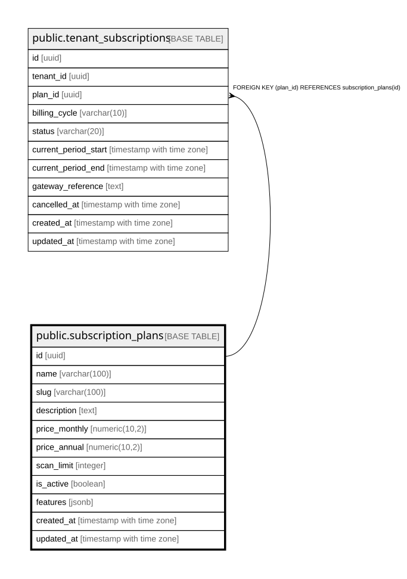

# public.subscription_plans

## Columns

| Name | Type | Default | Nullable | Children | Parents | Comment |
| ---- | ---- | ------- | -------- | -------- | ------- | ------- |
| id | uuid | gen_random_uuid() | false | [public.tenant_subscriptions](public.tenant_subscriptions.md) |  |  |
| name | varchar(100) |  | false |  |  |  |
| slug | varchar(100) |  | false |  |  |  |
| description | text |  | true |  |  |  |
| price_monthly | numeric(10,2) | 0 | false |  |  |  |
| price_annual | numeric(10,2) | 0 | false |  |  |  |
| scan_limit | integer | 1000 | false |  |  |  |
| is_active | boolean | true | true |  |  |  |
| features | jsonb | '{}'::jsonb | true |  |  |  |
| created_at | timestamp with time zone | now() | true |  |  |  |
| updated_at | timestamp with time zone | now() | true |  |  |  |

## Constraints

| Name | Type | Definition |
| ---- | ---- | ---------- |
| subscription_plans_pkey | PRIMARY KEY | PRIMARY KEY (id) |
| subscription_plans_slug_key | UNIQUE | UNIQUE (slug) |

## Indexes

| Name | Definition |
| ---- | ---------- |
| subscription_plans_pkey | CREATE UNIQUE INDEX subscription_plans_pkey ON public.subscription_plans USING btree (id) |
| subscription_plans_slug_key | CREATE UNIQUE INDEX subscription_plans_slug_key ON public.subscription_plans USING btree (slug) |
| idx_subscription_plans_slug | CREATE INDEX idx_subscription_plans_slug ON public.subscription_plans USING btree (slug) |
| idx_subscription_plans_active | CREATE INDEX idx_subscription_plans_active ON public.subscription_plans USING btree (is_active) |

## Relations

---

> Generated by [tbls](https://github.com/k1LoW/tbls)
