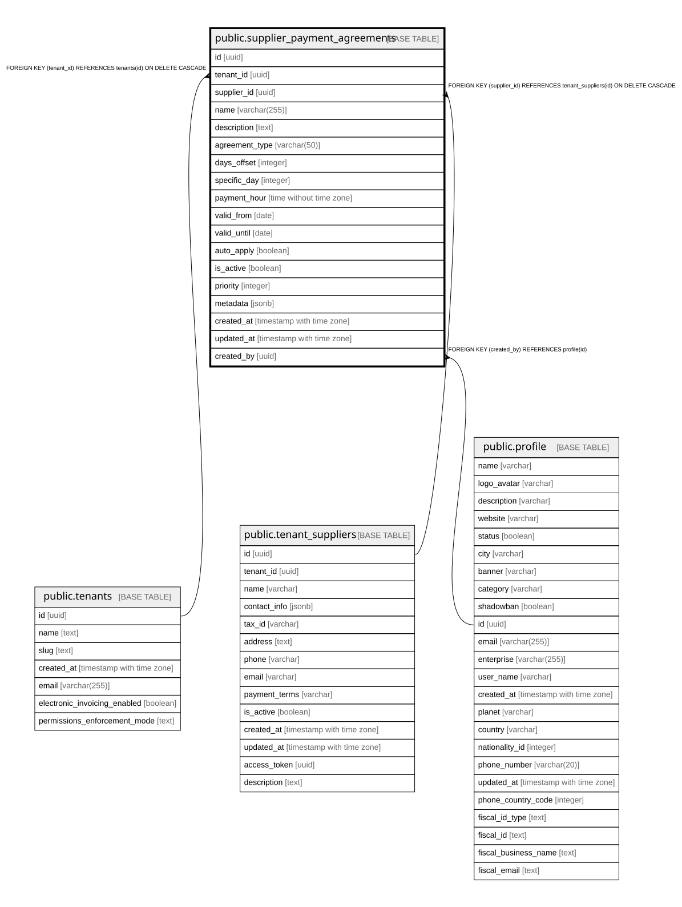

# public.supplier_payment_agreements

## Description

Acuerdos de pago automáticos configurados por proveedor

## Columns

| Name | Type | Default | Nullable | Children | Parents | Comment |
| ---- | ---- | ------- | -------- | -------- | ------- | ------- |
| id | uuid | gen_random_uuid() | false |  |  |  |
| tenant_id | uuid |  | false |  | [public.tenants](public.tenants.md) |  |
| supplier_id | uuid |  | false |  | [public.tenant_suppliers](public.tenant_suppliers.md) |  |
| name | varchar(255) |  | false |  |  |  |
| description | text |  | true |  |  |  |
| agreement_type | varchar(50) |  | false |  |  | Tipo: same_day, days_after_delivery, specific_day_month, end_of_month, custom |
| days_offset | integer |  | true |  |  | Días después de la entrega (para days_after_delivery) |
| specific_day | integer |  | true |  |  | Día específico del mes 1-31 (para specific_day_month) |
| payment_hour | time without time zone | '23:59:00'::time without time zone | true |  |  | Hora del día para realizar el pago (default 23:59) |
| valid_from | date |  | true |  |  |  |
| valid_until | date |  | true |  |  |  |
| auto_apply | boolean | false | true |  |  |  |
| is_active | boolean | true | true |  |  |  |
| priority | integer | 0 | true |  |  |  |
| metadata | jsonb |  | true |  |  |  |
| created_at | timestamp with time zone | now() | true |  |  |  |
| updated_at | timestamp with time zone | now() | true |  |  |  |
| created_by | uuid |  | true |  | [public.profile](public.profile.md) |  |

## Constraints

| Name | Type | Definition |
| ---- | ---- | ---------- |
| supplier_payment_agreements_agreement_type_check | CHECK | CHECK (((agreement_type)::text = ANY (ARRAY[('same_day'::character varying)::text, ('days_after_delivery'::character varying)::text, ('specific_day_month'::character varying)::text, ('end_of_month'::character varying)::text, ('custom'::character varying)::text]))) |
| supplier_payment_agreements_specific_day_check | CHECK | CHECK (((specific_day >= 1) AND (specific_day <= 31))) |
| supplier_payment_agreements_created_by_fkey | FOREIGN KEY | FOREIGN KEY (created_by) REFERENCES profile(id) |
| supplier_payment_agreements_pkey | PRIMARY KEY | PRIMARY KEY (id) |
| supplier_payment_agreements_supplier_id_fkey | FOREIGN KEY | FOREIGN KEY (supplier_id) REFERENCES tenant_suppliers(id) ON DELETE CASCADE |
| supplier_payment_agreements_tenant_id_fkey | FOREIGN KEY | FOREIGN KEY (tenant_id) REFERENCES tenants(id) ON DELETE CASCADE |

## Indexes

| Name | Definition |
| ---- | ---------- |
| supplier_payment_agreements_pkey | CREATE UNIQUE INDEX supplier_payment_agreements_pkey ON public.supplier_payment_agreements USING btree (id) |
| idx_payment_agreements_active | CREATE INDEX idx_payment_agreements_active ON public.supplier_payment_agreements USING btree (supplier_id, is_active) WHERE (is_active = true) |
| idx_payment_agreements_supplier | CREATE INDEX idx_payment_agreements_supplier ON public.supplier_payment_agreements USING btree (supplier_id) |
| idx_payment_agreements_tenant | CREATE INDEX idx_payment_agreements_tenant ON public.supplier_payment_agreements USING btree (tenant_id) |
| idx_payment_agreements_type | CREATE INDEX idx_payment_agreements_type ON public.supplier_payment_agreements USING btree (agreement_type) |

## Triggers

| Name | Definition |
| ---- | ---------- |
| payment_agreements_updated_at | CREATE TRIGGER payment_agreements_updated_at BEFORE UPDATE ON public.supplier_payment_agreements FOR EACH ROW EXECUTE FUNCTION update_payment_agreements_updated_at() |

## Relations

---

> Generated by [tbls](https://github.com/k1LoW/tbls)
