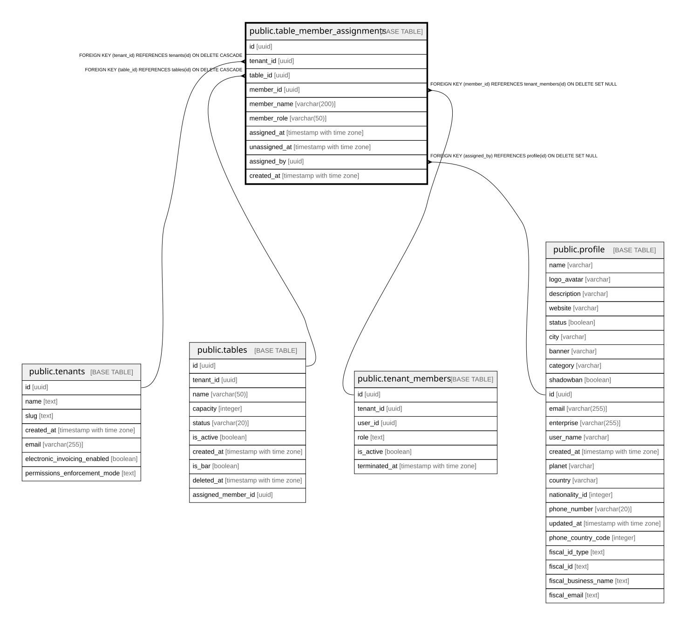

# public.table_member_assignments

## Description

Append-only history of default waiter assignments per table (warocol.com#573). Period model: each row spans one continuous assignment, with snapshots that survive member deletion.

## Columns

| Name | Type | Default | Nullable | Children | Parents | Comment |
| ---- | ---- | ------- | -------- | -------- | ------- | ------- |
| id | uuid | gen_random_uuid() | false |  |  |  |
| tenant_id | uuid |  | false |  | [public.tenants](public.tenants.md) |  |
| table_id | uuid |  | false |  | [public.tables](public.tables.md) |  |
| member_id | uuid |  | true |  | [public.tenant_members](public.tenant_members.md) |  |
| member_name | varchar(200) |  | true |  |  |  |
| member_role | varchar(50) |  | true |  |  |  |
| assigned_at | timestamp with time zone | now() | false |  |  |  |
| unassigned_at | timestamp with time zone |  | true |  |  |  |
| assigned_by | uuid |  | true |  | [public.profile](public.profile.md) |  |
| created_at | timestamp with time zone | now() | false |  |  |  |

## Constraints

| Name | Type | Definition |
| ---- | ---- | ---------- |
| table_member_assignments_assigned_by_fkey | FOREIGN KEY | FOREIGN KEY (assigned_by) REFERENCES profile(id) ON DELETE SET NULL |
| table_member_assignments_member_id_fkey | FOREIGN KEY | FOREIGN KEY (member_id) REFERENCES tenant_members(id) ON DELETE SET NULL |
| table_member_assignments_tenant_id_fkey | FOREIGN KEY | FOREIGN KEY (tenant_id) REFERENCES tenants(id) ON DELETE CASCADE |
| table_member_assignments_table_id_fkey | FOREIGN KEY | FOREIGN KEY (table_id) REFERENCES tables(id) ON DELETE CASCADE |
| table_member_assignments_pkey | PRIMARY KEY | PRIMARY KEY (id) |

## Indexes

| Name | Definition |
| ---- | ---------- |
| table_member_assignments_pkey | CREATE UNIQUE INDEX table_member_assignments_pkey ON public.table_member_assignments USING btree (id) |
| idx_tma_table_history | CREATE INDEX idx_tma_table_history ON public.table_member_assignments USING btree (table_id, assigned_at DESC) |
| idx_tma_current_per_table | CREATE INDEX idx_tma_current_per_table ON public.table_member_assignments USING btree (table_id) WHERE (unassigned_at IS NULL) |
| idx_tma_tenant | CREATE INDEX idx_tma_tenant ON public.table_member_assignments USING btree (tenant_id) |

## Relations

---

> Generated by [tbls](https://github.com/k1LoW/tbls)
