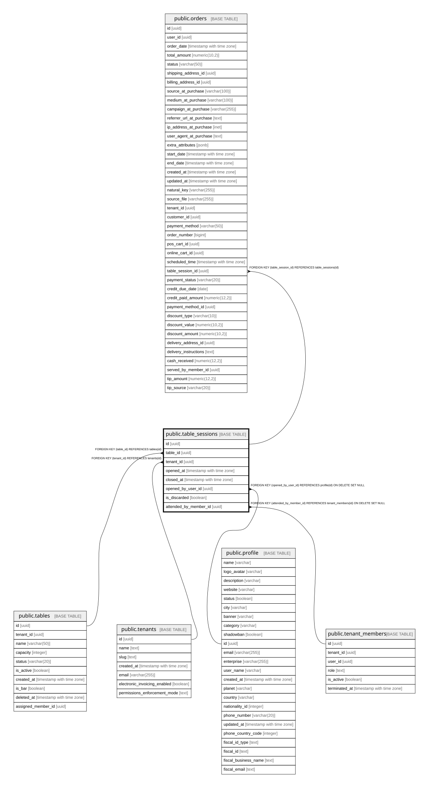

# public.table_sessions

## Columns

| Name | Type | Default | Nullable | Children | Parents | Comment |
| ---- | ---- | ------- | -------- | -------- | ------- | ------- |
| id | uuid | gen_random_uuid() | false | [public.orders](public.orders.md) [public.table_qr_requests](public.table_qr_requests.md) |  |  |
| table_id | uuid |  | false |  | [public.tables](public.tables.md) |  |
| tenant_id | uuid |  | false |  | [public.tenants](public.tenants.md) |  |
| opened_at | timestamp with time zone | now() | false |  |  |  |
| closed_at | timestamp with time zone |  | true |  |  |  |
| opened_by_user_id | uuid |  | true |  | [public.profile](public.profile.md) |  |
| is_discarded | boolean | false | false |  |  |  |
| attended_by_member_id | uuid |  | true |  | [public.tenant_members](public.tenant_members.md) | Override of the default waiter for this specific session (warocol.com#574). NULL = inherit from tables.assigned_member_id. Set at open via POST body or changed mid-session via PATCH /pos/tables/{id}/session-waiter. Auto-handoff rule enforced in app code: only the current waiter or supervisor+ can reassign. |
| minimum_consumption_enabled_snapshot | boolean | false | false |  |  | Snapshot of tenant minimum consumption / cover enabled flag when the session opened. |
| minimum_consumption_amount_snapshot | numeric | 0 | false |  |  | Snapshot of tenant minimum consumption / cover amount in COP when the session opened. |
| minimum_consumption_restrictive_snapshot | boolean | false | false |  |  | Snapshot of tenant restrictive close flag when the session opened. Enforcement is handled in later batches. |

## Constraints

| Name | Type | Definition |
| ---- | ---- | ---------- |
| table_sessions_opened_by_user_id_fkey | FOREIGN KEY | FOREIGN KEY (opened_by_user_id) REFERENCES profile(id) ON DELETE SET NULL |
| table_sessions_attended_by_member_id_fkey | FOREIGN KEY | FOREIGN KEY (attended_by_member_id) REFERENCES tenant_members(id) ON DELETE SET NULL |
| table_sessions_tenant_id_fkey | FOREIGN KEY | FOREIGN KEY (tenant_id) REFERENCES tenants(id) |
| table_sessions_table_id_fkey | FOREIGN KEY | FOREIGN KEY (table_id) REFERENCES tables(id) |
| table_sessions_pkey | PRIMARY KEY | PRIMARY KEY (id) |

## Indexes

| Name | Definition |
| ---- | ---------- |
| table_sessions_pkey | CREATE UNIQUE INDEX table_sessions_pkey ON public.table_sessions USING btree (id) |
| idx_table_sessions_table | CREATE INDEX idx_table_sessions_table ON public.table_sessions USING btree (table_id) |
| idx_table_sessions_open | CREATE INDEX idx_table_sessions_open ON public.table_sessions USING btree (table_id) WHERE (closed_at IS NULL) |
| idx_table_sessions_is_discarded | CREATE INDEX idx_table_sessions_is_discarded ON public.table_sessions USING btree (is_discarded) WHERE (is_discarded = true) |
| idx_table_sessions_attended_by | CREATE INDEX idx_table_sessions_attended_by ON public.table_sessions USING btree (attended_by_member_id) WHERE (attended_by_member_id IS NOT NULL) |

## Relations

---

> Generated by [tbls](https://github.com/k1LoW/tbls)
