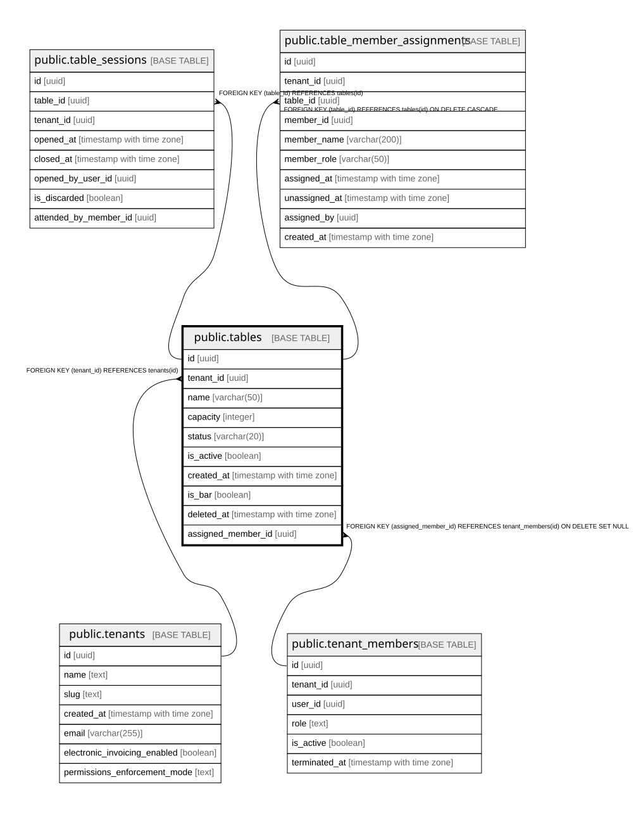

# public.tables

## Columns

| Name | Type | Default | Nullable | Children | Parents | Comment |
| ---- | ---- | ------- | -------- | -------- | ------- | ------- |
| id | uuid | gen_random_uuid() | false | [public.table_sessions](public.table_sessions.md) [public.table_member_assignments](public.table_member_assignments.md) [public.table_qr_requests](public.table_qr_requests.md) |  |  |
| tenant_id | uuid |  | false |  | [public.tenants](public.tenants.md) |  |
| name | varchar(50) |  | false |  |  |  |
| capacity | integer |  | true |  |  |  |
| status | varchar(20) | 'free'::character varying | false |  |  |  |
| is_active | boolean | true | false |  |  |  |
| created_at | timestamp with time zone | now() | true |  |  |  |
| is_bar | boolean | false | false |  |  |  |
| deleted_at | timestamp with time zone |  | true |  |  |  |
| assigned_member_id | uuid |  | true |  | [public.tenant_members](public.tenant_members.md) | Default waiter assigned to this table (warocol.com#573). NULL = no default. Bars (is_bar = true) should never have this set (enforced in application code, not DB constraint). Full history with snapshots lives in table_member_assignments. |
| qr_public_token | varchar(64) |  | true |  |  | Opaque public token for Table QR URL (api-warolabs#265). Generated via secrets.token_urlsafe(32) in #266 — not derivable from table_id. NULL until first enable/create. Globally unique when set. |
| qr_enabled | boolean | false | false |  |  | Per-table QR toggle (api-warolabs#265). When false, public resolve rejects access even if token is set. Default false. |
| display_order | integer |  | true |  |  | Optional manual display order for regular tenant tables in POS/Operaciones. NULL falls back to legacy name order; bar tables stay pinned by is_bar. |

## Constraints

| Name | Type | Definition |
| ---- | ---- | ---------- |
| tables_assigned_member_id_fkey | FOREIGN KEY | FOREIGN KEY (assigned_member_id) REFERENCES tenant_members(id) ON DELETE SET NULL |
| tables_tenant_id_fkey | FOREIGN KEY | FOREIGN KEY (tenant_id) REFERENCES tenants(id) |
| tables_pkey | PRIMARY KEY | PRIMARY KEY (id) |

## Indexes

| Name | Definition |
| ---- | ---------- |
| tables_pkey | CREATE UNIQUE INDEX tables_pkey ON public.tables USING btree (id) |
| idx_tables_tenant | CREATE INDEX idx_tables_tenant ON public.tables USING btree (tenant_id) |
| idx_tables_is_bar | CREATE INDEX idx_tables_is_bar ON public.tables USING btree (tenant_id, is_bar) WHERE (is_bar IS TRUE) |
| idx_tables_assigned_member | CREATE INDEX idx_tables_assigned_member ON public.tables USING btree (assigned_member_id) WHERE (assigned_member_id IS NOT NULL) |
| idx_tables_qr_public_token | CREATE UNIQUE INDEX idx_tables_qr_public_token ON public.tables USING btree (qr_public_token) WHERE (qr_public_token IS NOT NULL) |
| idx_tables_tenant_display_order | CREATE INDEX idx_tables_tenant_display_order ON public.tables USING btree (tenant_id, is_bar, is_active, display_order, name) WHERE (deleted_at IS NULL) |

## Relations

---

> Generated by [tbls](https://github.com/k1LoW/tbls)
