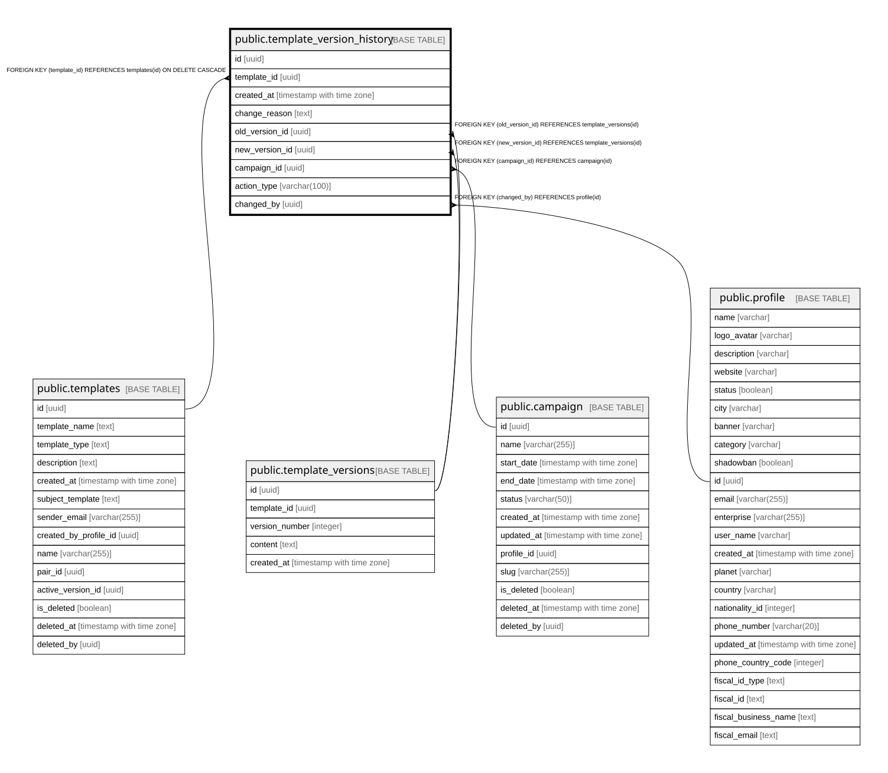

# public.template_version_history

## Columns

| Name | Type | Default | Nullable | Children | Parents | Comment |
| ---- | ---- | ------- | -------- | -------- | ------- | ------- |
| id | uuid | gen_random_uuid() | false |  |  |  |
| template_id | uuid |  | false |  | [public.templates](public.templates.md) |  |
| created_at | timestamp with time zone | now() | true |  |  |  |
| change_reason | text |  | true |  |  |  |
| old_version_id | uuid |  | true |  | [public.template_versions](public.template_versions.md) |  |
| new_version_id | uuid |  | true |  | [public.template_versions](public.template_versions.md) |  |
| campaign_id | uuid |  | true |  | [public.campaign](public.campaign.md) |  |
| action_type | varchar(100) |  | true |  |  |  |
| changed_by | uuid |  | true |  | [public.profile](public.profile.md) |  |

## Constraints

| Name | Type | Definition |
| ---- | ---- | ---------- |
| template_version_history_campaign_id_fkey | FOREIGN KEY | FOREIGN KEY (campaign_id) REFERENCES campaign(id) |
| template_version_history_changed_by_fkey | FOREIGN KEY | FOREIGN KEY (changed_by) REFERENCES profile(id) |
| template_version_history_pkey | PRIMARY KEY | PRIMARY KEY (id) |
| template_version_history_new_version_id_fkey | FOREIGN KEY | FOREIGN KEY (new_version_id) REFERENCES template_versions(id) |
| template_version_history_old_version_id_fkey | FOREIGN KEY | FOREIGN KEY (old_version_id) REFERENCES template_versions(id) |
| template_version_history_template_id_fkey | FOREIGN KEY | FOREIGN KEY (template_id) REFERENCES templates(id) ON DELETE CASCADE |

## Indexes

| Name | Definition |
| ---- | ---------- |
| template_version_history_pkey | CREATE UNIQUE INDEX template_version_history_pkey ON public.template_version_history USING btree (id) |
| idx_template_version_history_created_at | CREATE INDEX idx_template_version_history_created_at ON public.template_version_history USING btree (created_at) |
| idx_template_version_history_template | CREATE INDEX idx_template_version_history_template ON public.template_version_history USING btree (template_id) |

## Relations

---

> Generated by [tbls](https://github.com/k1LoW/tbls)
