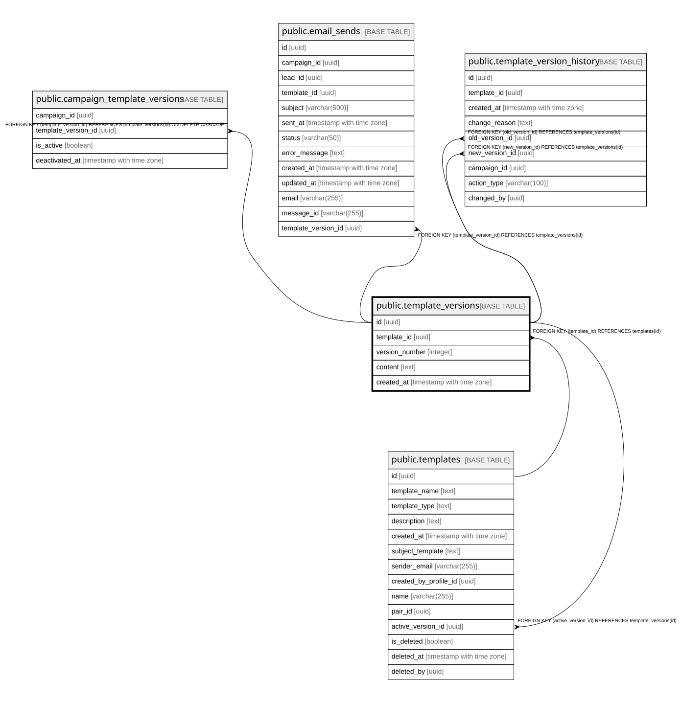

# public.template_versions

## Columns

| Name | Type | Default | Nullable | Children | Parents | Comment |
| ---- | ---- | ------- | -------- | -------- | ------- | ------- |
| id | uuid | gen_random_uuid() | false | [public.campaign_template_versions](public.campaign_template_versions.md) [public.email_sends](public.email_sends.md) [public.template_version_history](public.template_version_history.md) [public.templates](public.templates.md) |  |  |
| template_id | uuid |  | false |  | [public.templates](public.templates.md) |  |
| version_number | integer |  | false |  |  |  |
| content | text |  | false |  |  |  |
| created_at | timestamp with time zone | CURRENT_TIMESTAMP | true |  |  |  |

## Constraints

| Name | Type | Definition |
| ---- | ---- | ---------- |
| template_versions_pkey | PRIMARY KEY | PRIMARY KEY (id) |
| fk_template_id | FOREIGN KEY | FOREIGN KEY (template_id) REFERENCES templates(id) |
| uq_template_version | UNIQUE | UNIQUE (template_id, version_number) |

## Indexes

| Name | Definition |
| ---- | ---------- |
| template_versions_pkey | CREATE UNIQUE INDEX template_versions_pkey ON public.template_versions USING btree (id) |
| uq_template_version | CREATE UNIQUE INDEX uq_template_version ON public.template_versions USING btree (template_id, version_number) |

## Relations

---

> Generated by [tbls](https://github.com/k1LoW/tbls)
