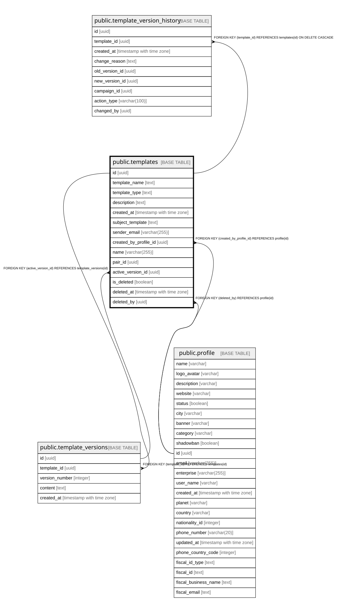

# public.templates

## Columns

| Name | Type | Default | Nullable | Children | Parents | Comment |
| ---- | ---- | ------- | -------- | -------- | ------- | ------- |
| id | uuid | gen_random_uuid() | false | [public.template_version_history](public.template_version_history.md) [public.template_versions](public.template_versions.md) |  |  |
| template_name | text |  | false |  |  |  |
| template_type | text |  | false |  |  |  |
| description | text |  | true |  |  |  |
| created_at | timestamp with time zone | CURRENT_TIMESTAMP | true |  |  |  |
| subject_template | text |  | true |  |  |  |
| sender_email | varchar(255) |  | true |  |  |  |
| created_by_profile_id | uuid |  | true |  | [public.profile](public.profile.md) |  |
| name | varchar(255) |  | true |  |  |  |
| pair_id | uuid |  | true |  |  |  |
| active_version_id | uuid |  | true |  | [public.template_versions](public.template_versions.md) |  |
| is_deleted | boolean | false | true |  |  |  |
| deleted_at | timestamp with time zone |  | true |  |  |  |
| deleted_by | uuid |  | true |  | [public.profile](public.profile.md) |  |

## Constraints

| Name | Type | Definition |
| ---- | ---- | ---------- |
| fk_templates_created_by_profile | FOREIGN KEY | FOREIGN KEY (created_by_profile_id) REFERENCES profile(id) |
| templates_deleted_by_fkey | FOREIGN KEY | FOREIGN KEY (deleted_by) REFERENCES profile(id) |
| templates_active_version_id_fkey | FOREIGN KEY | FOREIGN KEY (active_version_id) REFERENCES template_versions(id) |
| templates_pkey | PRIMARY KEY | PRIMARY KEY (id) |
| templates_template_name_key | UNIQUE | UNIQUE (template_name) |

## Indexes

| Name | Definition |
| ---- | ---------- |
| templates_pkey | CREATE UNIQUE INDEX templates_pkey ON public.templates USING btree (id) |
| templates_template_name_key | CREATE UNIQUE INDEX templates_template_name_key ON public.templates USING btree (template_name) |

## Relations

---

> Generated by [tbls](https://github.com/k1LoW/tbls)
