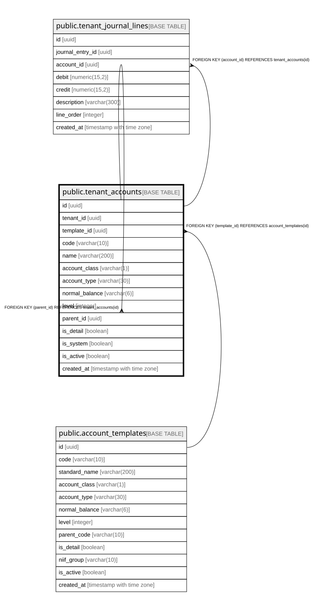

# public.tenant_accounts

## Description

Per-tenant chart of accounts. Seeded from account_templates on company creation. Tenants may customize names and add auxiliary sub-accounts.

## Columns

| Name | Type | Default | Nullable | Children | Parents | Comment |
| ---- | ---- | ------- | -------- | -------- | ------- | ------- |
| id | uuid | gen_random_uuid() | false | [public.tenant_accounts](public.tenant_accounts.md) [public.tenant_journal_lines](public.tenant_journal_lines.md) |  |  |
| tenant_id | uuid |  | false |  |  |  |
| template_id | uuid |  | true |  | [public.account_templates](public.account_templates.md) | FK to account_templates. NULL for custom sub-accounts not in the PUC standard. |
| code | varchar(10) |  | false |  |  |  |
| name | varchar(200) |  | false |  |  |  |
| account_class | varchar(1) |  | false |  |  |  |
| account_type | varchar(30) |  | false |  |  |  |
| normal_balance | varchar(6) |  | false |  |  |  |
| level | integer |  | false |  |  |  |
| parent_id | uuid |  | true |  | [public.tenant_accounts](public.tenant_accounts.md) |  |
| is_detail | boolean | false | false |  |  | true = journal lines can post directly to this account (leaf node) |
| is_system | boolean | false | false |  |  | true = seeded from PUC template. false = custom account created by tenant. |
| is_active | boolean | true | false |  |  |  |
| created_at | timestamp with time zone | now() | false |  |  |  |

## Constraints

| Name | Type | Definition |
| ---- | ---- | ---------- |
| tenant_accounts_account_class_check | CHECK | CHECK (((account_class)::text = ANY ((ARRAY['1'::character varying, '2'::character varying, '3'::character varying, '4'::character varying, '5'::character varying, '6'::character varying, '7'::character varying, '8'::character varying, '9'::character varying])::text[]))) |
| tenant_accounts_account_type_check | CHECK | CHECK (((account_type)::text = ANY ((ARRAY['asset'::character varying, 'liability'::character varying, 'equity'::character varying, 'income'::character varying, 'expense'::character varying, 'cogs'::character varying, 'other'::character varying])::text[]))) |
| tenant_accounts_level_check | CHECK | CHECK ((level = ANY (ARRAY[1, 2, 4, 6, 8]))) |
| tenant_accounts_normal_balance_check | CHECK | CHECK (((normal_balance)::text = ANY ((ARRAY['debit'::character varying, 'credit'::character varying])::text[]))) |
| tenant_accounts_template_id_fkey | FOREIGN KEY | FOREIGN KEY (template_id) REFERENCES account_templates(id) |
| tenant_accounts_parent_id_fkey | FOREIGN KEY | FOREIGN KEY (parent_id) REFERENCES tenant_accounts(id) |
| tenant_accounts_pkey | PRIMARY KEY | PRIMARY KEY (id) |
| uq_tenant_account_code | UNIQUE | UNIQUE (tenant_id, code) |

## Indexes

| Name | Definition |
| ---- | ---------- |
| tenant_accounts_pkey | CREATE UNIQUE INDEX tenant_accounts_pkey ON public.tenant_accounts USING btree (id) |
| uq_tenant_account_code | CREATE UNIQUE INDEX uq_tenant_account_code ON public.tenant_accounts USING btree (tenant_id, code) |
| idx_tenant_accounts_tenant | CREATE INDEX idx_tenant_accounts_tenant ON public.tenant_accounts USING btree (tenant_id) |
| idx_tenant_accounts_tenant_code | CREATE INDEX idx_tenant_accounts_tenant_code ON public.tenant_accounts USING btree (tenant_id, code) |
| idx_tenant_accounts_tenant_class | CREATE INDEX idx_tenant_accounts_tenant_class ON public.tenant_accounts USING btree (tenant_id, account_class) |
| idx_tenant_accounts_parent | CREATE INDEX idx_tenant_accounts_parent ON public.tenant_accounts USING btree (parent_id) |
| idx_tenant_accounts_template | CREATE INDEX idx_tenant_accounts_template ON public.tenant_accounts USING btree (template_id) WHERE (template_id IS NOT NULL) |

## Relations

---

> Generated by [tbls](https://github.com/k1LoW/tbls)
