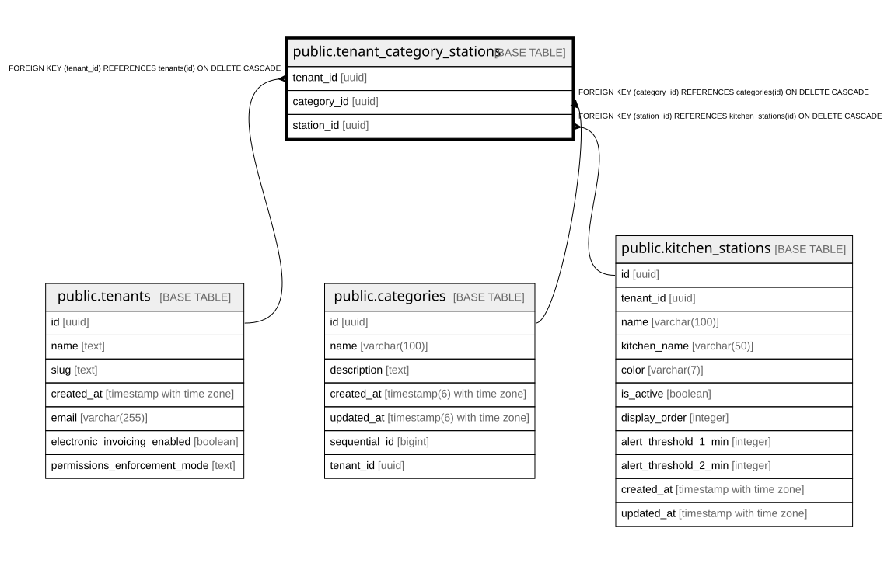

# public.tenant_category_stations

## Columns

| Name | Type | Default | Nullable | Children | Parents | Comment |
| ---- | ---- | ------- | -------- | -------- | ------- | ------- |
| tenant_id | uuid |  | false |  | [public.tenants](public.tenants.md) |  |
| category_id | uuid |  | false |  | [public.categories](public.categories.md) |  |
| station_id | uuid |  | false |  | [public.kitchen_stations](public.kitchen_stations.md) |  |

## Constraints

| Name | Type | Definition |
| ---- | ---- | ---------- |
| tenant_category_stations_category_id_fkey | FOREIGN KEY | FOREIGN KEY (category_id) REFERENCES categories(id) ON DELETE CASCADE |
| tenant_category_stations_tenant_id_fkey | FOREIGN KEY | FOREIGN KEY (tenant_id) REFERENCES tenants(id) ON DELETE CASCADE |
| tenant_category_stations_station_id_fkey | FOREIGN KEY | FOREIGN KEY (station_id) REFERENCES kitchen_stations(id) ON DELETE CASCADE |
| tenant_category_stations_pkey | PRIMARY KEY | PRIMARY KEY (tenant_id, category_id) |

## Indexes

| Name | Definition |
| ---- | ---------- |
| tenant_category_stations_pkey | CREATE UNIQUE INDEX tenant_category_stations_pkey ON public.tenant_category_stations USING btree (tenant_id, category_id) |
| idx_tenant_cat_stations_category | CREATE INDEX idx_tenant_cat_stations_category ON public.tenant_category_stations USING btree (category_id) |

## Relations

---

> Generated by [tbls](https://github.com/k1LoW/tbls)
