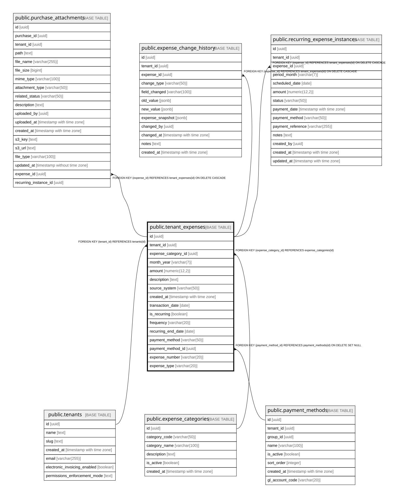

# public.tenant_expenses

## Columns

| Name | Type | Default | Nullable | Children | Parents | Comment |
| ---- | ---- | ------- | -------- | -------- | ------- | ------- |
| id | uuid | gen_random_uuid() | false | [public.purchase_attachments](public.purchase_attachments.md) [public.expense_change_history](public.expense_change_history.md) [public.recurring_expense_instances](public.recurring_expense_instances.md) |  |  |
| tenant_id | uuid |  | false |  | [public.tenants](public.tenants.md) |  |
| expense_category_id | uuid |  | false |  | [public.expense_categories](public.expense_categories.md) |  |
| month_year | varchar(7) |  | false |  |  |  |
| amount | numeric(12,2) |  | false |  |  |  |
| description | text |  | true |  |  |  |
| source_system | varchar(50) | 'manual'::character varying | true |  |  |  |
| created_at | timestamp with time zone | now() | true |  |  |  |
| transaction_date | date | CURRENT_DATE | true |  |  |  |
| is_recurring | boolean | false | true |  |  | True if this expense recurs automatically based on frequency |
| frequency | varchar(20) |  | true |  |  | Recurrence frequency: weekly, biweekly, monthly, quarterly, yearly. Required when is_recurring is TRUE |
| recurring_end_date | date |  | true |  |  | Optional end date for recurring expense. NULL means it recurs indefinitely |
| payment_method | varchar(50) | 'cash'::character varying | true |  |  |  |
| payment_method_id | uuid |  | true |  | [public.payment_methods](public.payment_methods.md) |  |
| expense_number | varchar(20) |  | true |  |  |  |
| expense_type | varchar(20) |  | true |  |  |  |

## Constraints

| Name | Type | Definition |
| ---- | ---- | ---------- |
| check_expense_frequency | CHECK | CHECK (((frequency IS NULL) OR ((frequency)::text = ANY ((ARRAY['weekly'::character varying, 'biweekly'::character varying, 'monthly'::character varying, 'quarterly'::character varying, 'yearly'::character varying])::text[])))) |
| check_recurring_end_date_future | CHECK | CHECK (((recurring_end_date IS NULL) OR (recurring_end_date >= transaction_date))) |
| check_recurring_has_frequency | CHECK | CHECK (((is_recurring = false) OR ((is_recurring = true) AND (frequency IS NOT NULL)))) |
| tenant_expenses_amount_check | CHECK | CHECK ((amount >= (0)::numeric)) |
| tenant_expenses_expense_type_check | CHECK | CHECK (((expense_type)::text = ANY ((ARRAY['cogs'::character varying, 'admin_expense'::character varying, 'sales_expense'::character varying, 'financial_expense'::character varying, 'other_expense'::character varying])::text[]))) |
| tenant_expenses_month_year_check | CHECK | CHECK (((month_year)::text ~ '^[0-9]{4}-[0-9]{2}$'::text)) |
| tenant_expenses_expense_category_id_fkey | FOREIGN KEY | FOREIGN KEY (expense_category_id) REFERENCES expense_categories(id) |
| tenant_expenses_pkey | PRIMARY KEY | PRIMARY KEY (id) |
| tenant_expenses_tenant_id_expense_category_id_month_year_de_key | UNIQUE | UNIQUE (tenant_id, expense_category_id, month_year, description) |
| tenant_expenses_tenant_id_fkey | FOREIGN KEY | FOREIGN KEY (tenant_id) REFERENCES tenants(id) |
| tenant_expenses_payment_method_id_fkey | FOREIGN KEY | FOREIGN KEY (payment_method_id) REFERENCES payment_methods(id) ON DELETE SET NULL |
| tenant_expenses_tenant_id_expense_number_key | UNIQUE | UNIQUE (tenant_id, expense_number) |

## Indexes

| Name | Definition |
| ---- | ---------- |
| tenant_expenses_pkey | CREATE UNIQUE INDEX tenant_expenses_pkey ON public.tenant_expenses USING btree (id) |
| tenant_expenses_tenant_id_expense_category_id_month_year_de_key | CREATE UNIQUE INDEX tenant_expenses_tenant_id_expense_category_id_month_year_de_key ON public.tenant_expenses USING btree (tenant_id, expense_category_id, month_year, description) |
| idx_tenant_expenses_category | CREATE INDEX idx_tenant_expenses_category ON public.tenant_expenses USING btree (expense_category_id) |
| idx_tenant_expenses_tenant_month | CREATE INDEX idx_tenant_expenses_tenant_month ON public.tenant_expenses USING btree (tenant_id, month_year) |
| idx_tenant_expenses_recurring | CREATE INDEX idx_tenant_expenses_recurring ON public.tenant_expenses USING btree (tenant_id, is_recurring) WHERE (is_recurring = true) |
| idx_tenant_expenses_recurring_end_date | CREATE INDEX idx_tenant_expenses_recurring_end_date ON public.tenant_expenses USING btree (tenant_id, recurring_end_date) WHERE ((is_recurring = true) AND (recurring_end_date IS NOT NULL)) |
| tenant_expenses_tenant_id_expense_number_key | CREATE UNIQUE INDEX tenant_expenses_tenant_id_expense_number_key ON public.tenant_expenses USING btree (tenant_id, expense_number) |

## Relations

---

> Generated by [tbls](https://github.com/k1LoW/tbls)
