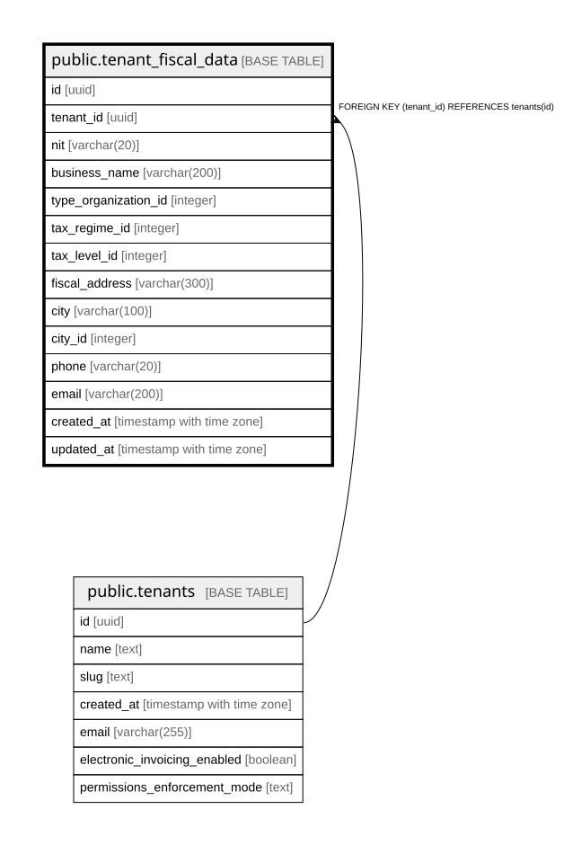

# public.tenant_fiscal_data

## Columns

| Name | Type | Default | Nullable | Children | Parents | Comment |
| ---- | ---- | ------- | -------- | -------- | ------- | ------- |
| id | uuid | gen_random_uuid() | false |  |  |  |
| tenant_id | uuid |  | false |  | [public.tenants](public.tenants.md) |  |
| nit | varchar(20) |  | true |  |  |  |
| business_name | varchar(200) |  | true |  |  |  |
| type_organization_id | integer | 1 | false |  |  |  |
| tax_regime_id | integer | 2 | false |  |  |  |
| tax_level_id | integer | 5 | false |  |  |  |
| fiscal_address | varchar(300) |  | true |  |  |  |
| city | varchar(100) |  | true |  |  |  |
| city_id | integer | 149 | true |  |  |  |
| phone | varchar(20) |  | true |  |  |  |
| email | varchar(200) |  | true |  |  |  |
| created_at | timestamp with time zone | now() | false |  |  |  |
| updated_at | timestamp with time zone | now() | false |  |  |  |

## Constraints

| Name | Type | Definition |
| ---- | ---- | ---------- |
| tenant_fiscal_data_tenant_id_fkey | FOREIGN KEY | FOREIGN KEY (tenant_id) REFERENCES tenants(id) |
| tenant_fiscal_data_pkey | PRIMARY KEY | PRIMARY KEY (id) |
| tenant_fiscal_data_tenant_id_key | UNIQUE | UNIQUE (tenant_id) |

## Indexes

| Name | Definition |
| ---- | ---------- |
| tenant_fiscal_data_pkey | CREATE UNIQUE INDEX tenant_fiscal_data_pkey ON public.tenant_fiscal_data USING btree (id) |
| tenant_fiscal_data_tenant_id_key | CREATE UNIQUE INDEX tenant_fiscal_data_tenant_id_key ON public.tenant_fiscal_data USING btree (tenant_id) |

## Relations

---

> Generated by [tbls](https://github.com/k1LoW/tbls)
