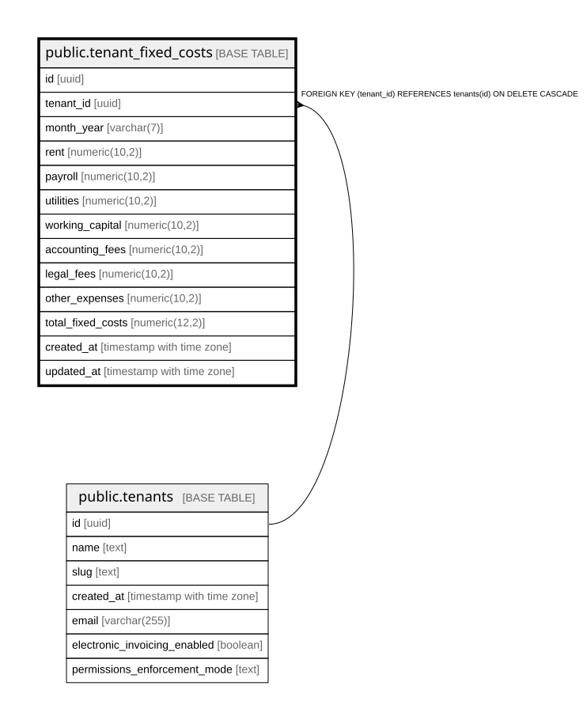

# public.tenant_fixed_costs

## Columns

| Name | Type | Default | Nullable | Extra Definition | Children | Parents | Comment |
| ---- | ---- | ------- | -------- | ---------------- | -------- | ------- | ------- |
| id | uuid | gen_random_uuid() | false |  |  |  |  |
| tenant_id | uuid |  | false |  |  | [public.tenants](public.tenants.md) |  |
| month_year | varchar(7) |  | false |  |  |  |  |
| rent | numeric(10,2) | 0 | true |  |  |  |  |
| payroll | numeric(10,2) | 0 | true |  |  |  |  |
| utilities | numeric(10,2) | 0 | true |  |  |  |  |
| working_capital | numeric(10,2) | 0 | true |  |  |  |  |
| accounting_fees | numeric(10,2) | 0 | true |  |  |  |  |
| legal_fees | numeric(10,2) | 0 | true |  |  |  |  |
| other_expenses | numeric(10,2) | 0 | true |  |  |  |  |
| total_fixed_costs | numeric(12,2) |  | true | GENERATED ALWAYS AS ((((((rent + payroll) + utilities) + working_capital) + accounting_fees) + legal_fees) + other_expenses) STORED |  |  |  |
| created_at | timestamp with time zone | now() | true |  |  |  |  |
| updated_at | timestamp with time zone | now() | true |  |  |  |  |

## Constraints

| Name | Type | Definition |
| ---- | ---- | ---------- |
| tenant_fixed_costs_accounting_fees_check | CHECK | CHECK ((accounting_fees >= (0)::numeric)) |
| tenant_fixed_costs_legal_fees_check | CHECK | CHECK ((legal_fees >= (0)::numeric)) |
| tenant_fixed_costs_month_year_check | CHECK | CHECK (((month_year)::text ~ '^[0-9]{4}-[0-9]{2}$'::text)) |
| tenant_fixed_costs_other_expenses_check | CHECK | CHECK ((other_expenses >= (0)::numeric)) |
| tenant_fixed_costs_payroll_check | CHECK | CHECK ((payroll >= (0)::numeric)) |
| tenant_fixed_costs_rent_check | CHECK | CHECK ((rent >= (0)::numeric)) |
| tenant_fixed_costs_utilities_check | CHECK | CHECK ((utilities >= (0)::numeric)) |
| tenant_fixed_costs_working_capital_check | CHECK | CHECK ((working_capital >= (0)::numeric)) |
| tenant_fixed_costs_pkey | PRIMARY KEY | PRIMARY KEY (id) |
| tenant_fixed_costs_tenant_id_fkey | FOREIGN KEY | FOREIGN KEY (tenant_id) REFERENCES tenants(id) ON DELETE CASCADE |
| unique_tenant_month | UNIQUE | UNIQUE (tenant_id, month_year) |

## Indexes

| Name | Definition |
| ---- | ---------- |
| tenant_fixed_costs_pkey | CREATE UNIQUE INDEX tenant_fixed_costs_pkey ON public.tenant_fixed_costs USING btree (id) |
| unique_tenant_month | CREATE UNIQUE INDEX unique_tenant_month ON public.tenant_fixed_costs USING btree (tenant_id, month_year) |
| idx_tenant_fixed_costs_month_year | CREATE INDEX idx_tenant_fixed_costs_month_year ON public.tenant_fixed_costs USING btree (month_year) |
| idx_tenant_fixed_costs_tenant_month | CREATE INDEX idx_tenant_fixed_costs_tenant_month ON public.tenant_fixed_costs USING btree (tenant_id, month_year) |

## Triggers

| Name | Definition |
| ---- | ---------- |
| update_tenant_fixed_costs_updated_at | CREATE TRIGGER update_tenant_fixed_costs_updated_at BEFORE UPDATE ON public.tenant_fixed_costs FOR EACH ROW EXECUTE FUNCTION update_updated_at_column() |

## Relations

---

> Generated by [tbls](https://github.com/k1LoW/tbls)
