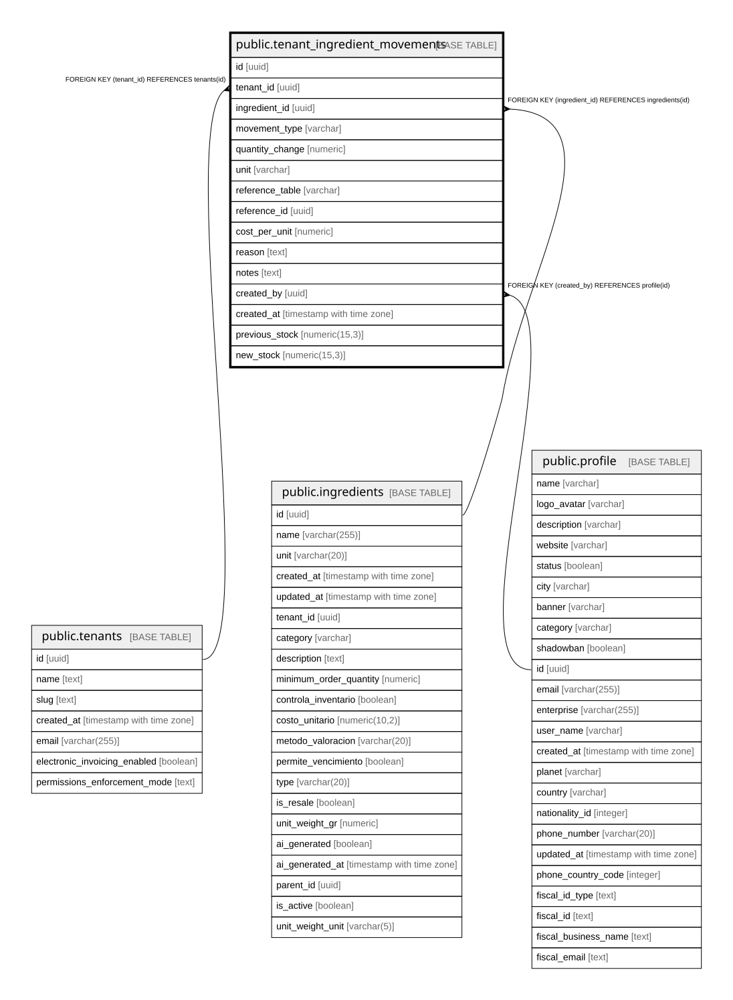

# public.tenant_ingredient_movements

## Description

Histórico completo de movimientos de inventario por ingrediente

## Columns

| Name | Type | Default | Nullable | Children | Parents | Comment |
| ---- | ---- | ------- | -------- | -------- | ------- | ------- |
| id | uuid | gen_random_uuid() | false |  |  |  |
| tenant_id | uuid |  | false |  | [public.tenants](public.tenants.md) |  |
| ingredient_id | uuid |  | false |  | [public.ingredients](public.ingredients.md) |  |
| movement_type | varchar |  | false |  |  | purchase: entrada por compra, consumption: salida por uso, adjustment: ajuste manual, loss: pérdida, transfer: transferencia, return: devolución |
| quantity_change | numeric |  | false |  |  | Positivo = entrada al inventario, Negativo = salida del inventario |
| unit | varchar |  | false |  |  |  |
| reference_table | varchar |  | true |  |  |  |
| reference_id | uuid |  | true |  |  |  |
| cost_per_unit | numeric |  | true |  |  |  |
| reason | text |  | true |  |  |  |
| notes | text |  | true |  |  |  |
| created_by | uuid |  | true |  | [public.profile](public.profile.md) |  |
| created_at | timestamp with time zone | now() | true |  |  |  |
| previous_stock | numeric(15,3) |  | true |  |  | Stock antes del movimiento (snapshot para auditoría y reconstrucción histórica) |
| new_stock | numeric(15,3) |  | true |  |  | Stock después del movimiento (snapshot para auditoría y verificación) |

## Constraints

| Name | Type | Definition |
| ---- | ---- | ---------- |
| tenant_ingredient_movements_movement_type_check | CHECK | CHECK (((movement_type)::text = ANY (ARRAY[('purchase'::character varying)::text, ('consumption'::character varying)::text, ('adjustment'::character varying)::text, ('loss'::character varying)::text, ('transfer'::character varying)::text, ('return'::character varying)::text]))) |
| tenant_ingredient_movements_ingredient_id_fkey | FOREIGN KEY | FOREIGN KEY (ingredient_id) REFERENCES ingredients(id) |
| tenant_ingredient_movements_created_by_fkey | FOREIGN KEY | FOREIGN KEY (created_by) REFERENCES profile(id) |
| tenant_ingredient_movements_pkey | PRIMARY KEY | PRIMARY KEY (id) |
| tenant_ingredient_movements_tenant_id_fkey | FOREIGN KEY | FOREIGN KEY (tenant_id) REFERENCES tenants(id) |

## Indexes

| Name | Definition |
| ---- | ---------- |
| tenant_ingredient_movements_pkey | CREATE UNIQUE INDEX tenant_ingredient_movements_pkey ON public.tenant_ingredient_movements USING btree (id) |
| idx_movements_ingredient_date | CREATE INDEX idx_movements_ingredient_date ON public.tenant_ingredient_movements USING btree (ingredient_id, created_at DESC) |
| idx_movements_reference | CREATE INDEX idx_movements_reference ON public.tenant_ingredient_movements USING btree (reference_table, reference_id) |
| idx_movements_tenant_date | CREATE INDEX idx_movements_tenant_date ON public.tenant_ingredient_movements USING btree (tenant_id, created_at DESC) |
| idx_tenant_ingredient_movements_date | CREATE INDEX idx_tenant_ingredient_movements_date ON public.tenant_ingredient_movements USING btree (created_at) |
| idx_tenant_ingredient_movements_ingredient | CREATE INDEX idx_tenant_ingredient_movements_ingredient ON public.tenant_ingredient_movements USING btree (ingredient_id) |
| idx_tenant_ingredient_movements_reference | CREATE INDEX idx_tenant_ingredient_movements_reference ON public.tenant_ingredient_movements USING btree (reference_table, reference_id) |
| idx_tenant_ingredient_movements_tenant | CREATE INDEX idx_tenant_ingredient_movements_tenant ON public.tenant_ingredient_movements USING btree (tenant_id) |
| idx_tenant_ingredient_movements_tenant_ingredient | CREATE INDEX idx_tenant_ingredient_movements_tenant_ingredient ON public.tenant_ingredient_movements USING btree (tenant_id, ingredient_id) |
| idx_tenant_ingredient_movements_type | CREATE INDEX idx_tenant_ingredient_movements_type ON public.tenant_ingredient_movements USING btree (movement_type) |
| idx_movements_cost_lookup | CREATE INDEX idx_movements_cost_lookup ON public.tenant_ingredient_movements USING btree (tenant_id, ingredient_id, created_at DESC) WHERE (cost_per_unit IS NOT NULL) |

## Relations

---

> Generated by [tbls](https://github.com/k1LoW/tbls)
