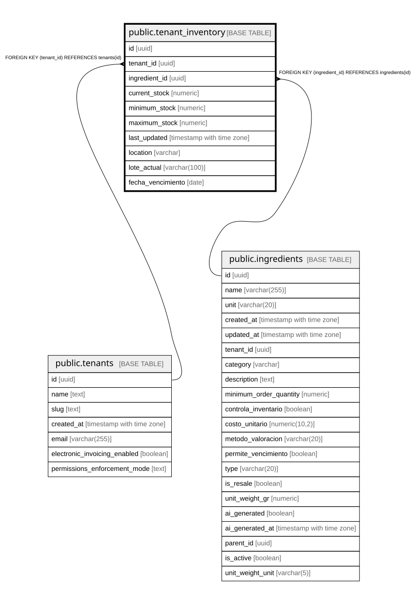

# public.tenant_inventory

## Description

Inventario actual por tenant e ingrediente

## Columns

| Name | Type | Default | Nullable | Children | Parents | Comment |
| ---- | ---- | ------- | -------- | -------- | ------- | ------- |
| id | uuid | gen_random_uuid() | false |  |  |  |
| tenant_id | uuid |  | false |  | [public.tenants](public.tenants.md) |  |
| ingredient_id | uuid |  | false |  | [public.ingredients](public.ingredients.md) |  |
| current_stock | numeric | 0 | true |  |  |  |
| minimum_stock | numeric | 0 | true |  |  |  |
| maximum_stock | numeric |  | true |  |  |  |
| last_updated | timestamp with time zone | now() | true |  |  |  |
| location | varchar |  | true |  |  |  |
| lote_actual | varchar(100) |  | true |  |  | Número de lote actual del inventario (para trazabilidad) |
| fecha_vencimiento | date |  | true |  |  | Fecha de vencimiento del lote actual |

## Constraints

| Name | Type | Definition |
| ---- | ---- | ---------- |
| tenant_inventory_ingredient_id_fkey | FOREIGN KEY | FOREIGN KEY (ingredient_id) REFERENCES ingredients(id) |
| tenant_inventory_pkey | PRIMARY KEY | PRIMARY KEY (id) |
| tenant_inventory_tenant_id_ingredient_id_key | UNIQUE | UNIQUE (tenant_id, ingredient_id) |
| tenant_inventory_tenant_id_fkey | FOREIGN KEY | FOREIGN KEY (tenant_id) REFERENCES tenants(id) |

## Indexes

| Name | Definition |
| ---- | ---------- |
| tenant_inventory_pkey | CREATE UNIQUE INDEX tenant_inventory_pkey ON public.tenant_inventory USING btree (id) |
| tenant_inventory_tenant_id_ingredient_id_key | CREATE UNIQUE INDEX tenant_inventory_tenant_id_ingredient_id_key ON public.tenant_inventory USING btree (tenant_id, ingredient_id) |
| idx_tenant_inventory_expiry | CREATE INDEX idx_tenant_inventory_expiry ON public.tenant_inventory USING btree (fecha_vencimiento) WHERE (fecha_vencimiento IS NOT NULL) |
| idx_tenant_inventory_low_stock | CREATE INDEX idx_tenant_inventory_low_stock ON public.tenant_inventory USING btree (tenant_id, ingredient_id) WHERE (current_stock <= minimum_stock) |
| idx_tenant_inventory_tenant_ingredient | CREATE INDEX idx_tenant_inventory_tenant_ingredient ON public.tenant_inventory USING btree (tenant_id, ingredient_id) |

## Relations

---

> Generated by [tbls](https://github.com/k1LoW/tbls)
