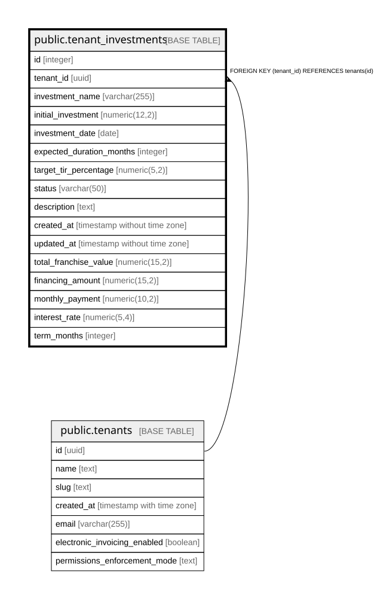

# public.tenant_investments

## Columns

| Name | Type | Default | Nullable | Children | Parents | Comment |
| ---- | ---- | ------- | -------- | -------- | ------- | ------- |
| id | integer | nextval('tenant_investments_id_seq'::regclass) | false |  |  |  |
| tenant_id | uuid |  | false |  | [public.tenants](public.tenants.md) |  |
| investment_name | varchar(255) |  | false |  |  |  |
| initial_investment | numeric(12,2) |  | false |  |  |  |
| investment_date | date | CURRENT_DATE | false |  |  |  |
| expected_duration_months | integer | 12 | true |  |  |  |
| target_tir_percentage | numeric(5,2) | 8.00 | true |  |  |  |
| status | varchar(50) | 'active'::character varying | true |  |  |  |
| description | text |  | true |  |  |  |
| created_at | timestamp without time zone | now() | true |  |  |  |
| updated_at | timestamp without time zone | now() | true |  |  |  |
| total_franchise_value | numeric(15,2) |  | true |  |  | Valor total de la franquicia |
| financing_amount | numeric(15,2) |  | true |  |  | Monto financiado |
| monthly_payment | numeric(10,2) |  | true |  |  | Cuota mensual |
| interest_rate | numeric(5,4) |  | true |  |  | Tasa de interés mensual (decimal) |
| term_months | integer |  | true |  |  | Plazo en meses |

## Constraints

| Name | Type | Definition |
| ---- | ---- | ---------- |
| tenant_investments_financing_amount_check | CHECK | CHECK ((financing_amount >= (0)::numeric)) |
| tenant_investments_interest_rate_check | CHECK | CHECK (((interest_rate >= (0)::numeric) AND (interest_rate <= (1)::numeric))) |
| tenant_investments_monthly_payment_check | CHECK | CHECK ((monthly_payment >= (0)::numeric)) |
| tenant_investments_term_months_check | CHECK | CHECK ((term_months > 0)) |
| tenant_investments_total_franchise_value_check | CHECK | CHECK ((total_franchise_value >= (0)::numeric)) |
| tenant_investments_pkey | PRIMARY KEY | PRIMARY KEY (id) |
| tenant_investments_tenant_id_investment_name_key | UNIQUE | UNIQUE (tenant_id, investment_name) |
| tenant_investments_tenant_id_fkey | FOREIGN KEY | FOREIGN KEY (tenant_id) REFERENCES tenants(id) |

## Indexes

| Name | Definition |
| ---- | ---------- |
| tenant_investments_pkey | CREATE UNIQUE INDEX tenant_investments_pkey ON public.tenant_investments USING btree (id) |
| tenant_investments_tenant_id_investment_name_key | CREATE UNIQUE INDEX tenant_investments_tenant_id_investment_name_key ON public.tenant_investments USING btree (tenant_id, investment_name) |
| idx_tenant_investments_status | CREATE INDEX idx_tenant_investments_status ON public.tenant_investments USING btree (tenant_id, status) |
| idx_tenant_investments_tenant | CREATE INDEX idx_tenant_investments_tenant ON public.tenant_investments USING btree (tenant_id) |

## Relations

---

> Generated by [tbls](https://github.com/k1LoW/tbls)
