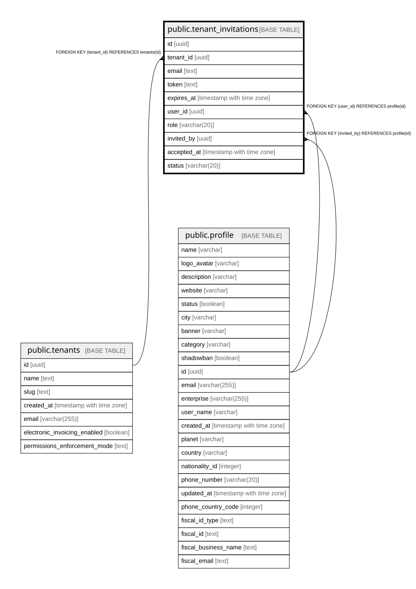

# public.tenant_invitations

## Columns

| Name | Type | Default | Nullable | Children | Parents | Comment |
| ---- | ---- | ------- | -------- | -------- | ------- | ------- |
| id | uuid |  | false |  |  |  |
| tenant_id | uuid |  | false |  | [public.tenants](public.tenants.md) |  |
| email | text |  | false |  |  |  |
| token | text |  | false |  |  |  |
| expires_at | timestamp with time zone |  | false |  |  |  |
| user_id | uuid |  | true |  | [public.profile](public.profile.md) |  |
| role | varchar(20) | 'admin'::character varying | true |  |  |  |
| invited_by | uuid |  | true |  | [public.profile](public.profile.md) |  |
| accepted_at | timestamp with time zone |  | true |  |  |  |
| status | varchar(20) | 'pending'::character varying | true |  |  |  |

## Constraints

| Name | Type | Definition |
| ---- | ---- | ---------- |
| tenant_invitations_invited_by_fkey | FOREIGN KEY | FOREIGN KEY (invited_by) REFERENCES profile(id) |
| tenant_invitations_user_id_fkey | FOREIGN KEY | FOREIGN KEY (user_id) REFERENCES profile(id) |
| tenant_invitations_pkey | PRIMARY KEY | PRIMARY KEY (id) |
| tenant_invitations_token_unique | UNIQUE | UNIQUE (token) |
| tenant_invitations_tenant_id_tenants_id_fk | FOREIGN KEY | FOREIGN KEY (tenant_id) REFERENCES tenants(id) |

## Indexes

| Name | Definition |
| ---- | ---------- |
| tenant_invitations_pkey | CREATE UNIQUE INDEX tenant_invitations_pkey ON public.tenant_invitations USING btree (id) |
| tenant_invitations_token_unique | CREATE UNIQUE INDEX tenant_invitations_token_unique ON public.tenant_invitations USING btree (token) |

## Relations

---

> Generated by [tbls](https://github.com/k1LoW/tbls)
