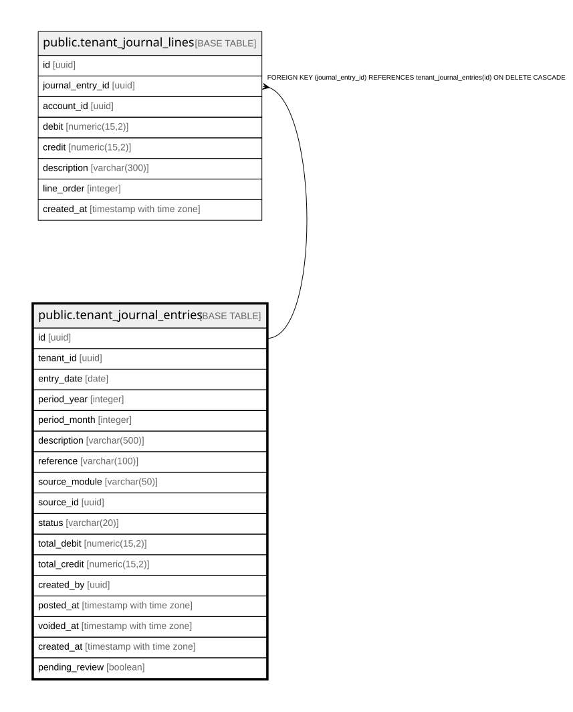

# public.tenant_journal_entries

## Description

Double-entry journal. sum(total_debit) must equal sum(total_credit) for posted entries. Enforced at service layer.

## Columns

| Name | Type | Default | Nullable | Children | Parents | Comment |
| ---- | ---- | ------- | -------- | -------- | ------- | ------- |
| id | uuid | gen_random_uuid() | false | [public.tenant_journal_lines](public.tenant_journal_lines.md) |  |  |
| tenant_id | uuid |  | false |  |  |  |
| entry_date | date |  | false |  |  |  |
| period_year | integer |  | false |  |  | Denormalized from entry_date for fast period GROUP BY queries. |
| period_month | integer |  | false |  |  | Denormalized from entry_date for fast period GROUP BY queries. |
| description | varchar(500) |  | false |  |  |  |
| reference | varchar(100) |  | true |  |  |  |
| source_module | varchar(50) |  | true |  |  | Which WARO module generated this entry. NULL for manual entries. |
| source_id | uuid |  | true |  |  |  |
| status | varchar(20) | 'draft'::character varying | false |  |  |  |
| total_debit | numeric(15,2) | 0 | false |  |  | Denormalized sum of line debits. Kept current by service layer on create/update. |
| total_credit | numeric(15,2) | 0 | false |  |  |  |
| created_by | uuid |  | true |  |  |  |
| posted_at | timestamp with time zone |  | true |  |  |  |
| voided_at | timestamp with time zone |  | true |  |  |  |
| created_at | timestamp with time zone | now() | false |  |  |  |
| pending_review | boolean | false | false |  |  | Annotation flag — when true, the asiento is fully posted and balanced, but the contraparte was chosen by the operator as "no estoy seguro" and should be reviewed by an accountant later (typically before fiscal close). |

## Constraints

| Name | Type | Definition |
| ---- | ---- | ---------- |
| tenant_journal_entries_period_month_check | CHECK | CHECK (((period_month >= 1) AND (period_month <= 12))) |
| tenant_journal_entries_source_module_check | CHECK | CHECK (((source_module IS NULL) OR ((source_module)::text = ANY (ARRAY['gastos'::text, 'ventas'::text, 'orden'::text, 'orden_cogs'::text, 'nomina'::text, 'nomina_provision'::text, 'nomina_ss'::text, 'nomina_prima'::text, 'nomina_cesantias'::text, 'nomina_int_cesantias'::text, 'nomina_vacaciones'::text, 'nomina_dotacion'::text, 'nomina_pila'::text, 'nomina_horas_extras'::text, 'nomina_liquidacion'::text, 'inventario'::text, 'cartera'::text, 'arqueo'::text, 'manual'::text, 'system'::text, 'manual_balance_adjustment'::text])))) |
| tenant_journal_entries_status_check | CHECK | CHECK (((status)::text = ANY ((ARRAY['draft'::character varying, 'posted'::character varying, 'voided'::character varying])::text[]))) |
| tenant_journal_entries_pkey | PRIMARY KEY | PRIMARY KEY (id) |

## Indexes

| Name | Definition |
| ---- | ---------- |
| tenant_journal_entries_pkey | CREATE UNIQUE INDEX tenant_journal_entries_pkey ON public.tenant_journal_entries USING btree (id) |
| idx_je_tenant | CREATE INDEX idx_je_tenant ON public.tenant_journal_entries USING btree (tenant_id) |
| idx_je_tenant_date | CREATE INDEX idx_je_tenant_date ON public.tenant_journal_entries USING btree (tenant_id, entry_date) |
| idx_je_tenant_period | CREATE INDEX idx_je_tenant_period ON public.tenant_journal_entries USING btree (tenant_id, period_year, period_month) |
| idx_je_source | CREATE INDEX idx_je_source ON public.tenant_journal_entries USING btree (source_module, source_id) WHERE (source_id IS NOT NULL) |
| idx_je_status_posted | CREATE INDEX idx_je_status_posted ON public.tenant_journal_entries USING btree (tenant_id, entry_date) WHERE ((status)::text = 'posted'::text) |
| idx_je_orden | CREATE INDEX idx_je_orden ON public.tenant_journal_entries USING btree (tenant_id, source_id) WHERE ((source_module)::text = 'orden'::text) |
| idx_je_pending_review | CREATE INDEX idx_je_pending_review ON public.tenant_journal_entries USING btree (tenant_id, pending_review) WHERE (pending_review = true) |

## Relations

---

> Generated by [tbls](https://github.com/k1LoW/tbls)
