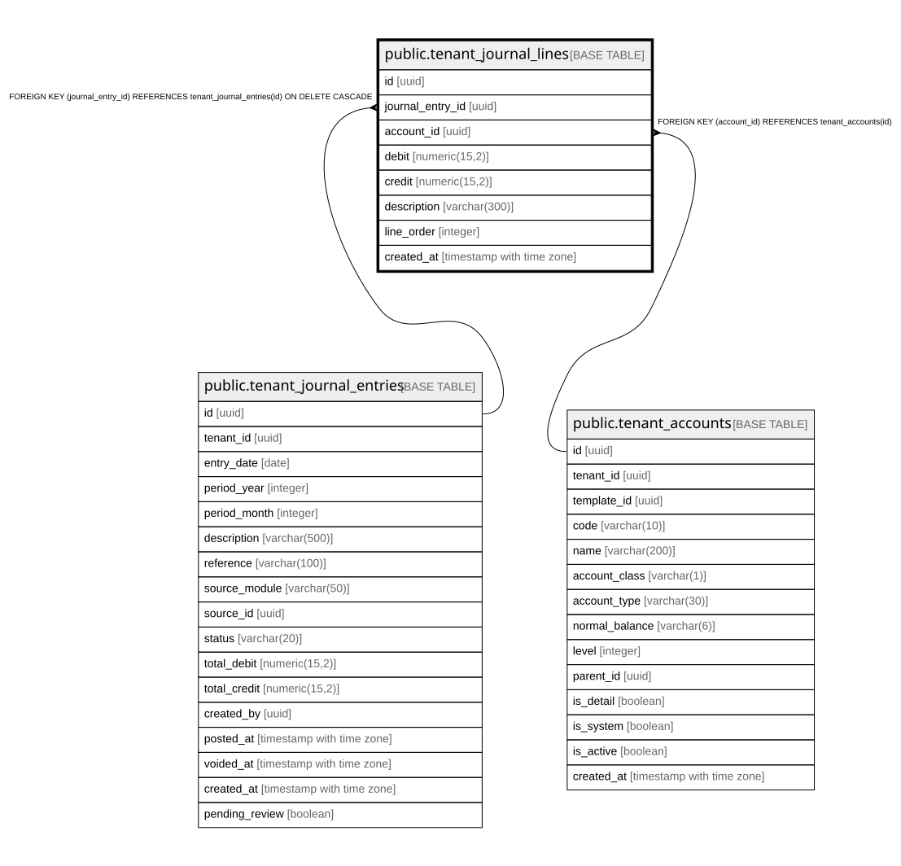

# public.tenant_journal_lines

## Description

Individual debit/credit lines of a journal entry. A line cannot have both debit > 0 and credit > 0.

## Columns

| Name | Type | Default | Nullable | Children | Parents | Comment |
| ---- | ---- | ------- | -------- | -------- | ------- | ------- |
| id | uuid | gen_random_uuid() | false |  |  |  |
| journal_entry_id | uuid |  | false |  | [public.tenant_journal_entries](public.tenant_journal_entries.md) |  |
| account_id | uuid |  | false |  | [public.tenant_accounts](public.tenant_accounts.md) |  |
| debit | numeric(15,2) | 0 | false |  |  |  |
| credit | numeric(15,2) | 0 | false |  |  |  |
| description | varchar(300) |  | true |  |  |  |
| line_order | integer | 0 | false |  |  |  |
| created_at | timestamp with time zone | now() | false |  |  |  |

## Constraints

| Name | Type | Definition |
| ---- | ---- | ---------- |
| chk_line_debit_or_credit | CHECK | CHECK ((NOT ((debit > (0)::numeric) AND (credit > (0)::numeric)))) |
| chk_line_not_zero | CHECK | CHECK (((debit > (0)::numeric) OR (credit > (0)::numeric))) |
| tenant_journal_lines_credit_check | CHECK | CHECK ((credit >= (0)::numeric)) |
| tenant_journal_lines_debit_check | CHECK | CHECK ((debit >= (0)::numeric)) |
| tenant_journal_lines_account_id_fkey | FOREIGN KEY | FOREIGN KEY (account_id) REFERENCES tenant_accounts(id) |
| tenant_journal_lines_journal_entry_id_fkey | FOREIGN KEY | FOREIGN KEY (journal_entry_id) REFERENCES tenant_journal_entries(id) ON DELETE CASCADE |
| tenant_journal_lines_pkey | PRIMARY KEY | PRIMARY KEY (id) |

## Indexes

| Name | Definition |
| ---- | ---------- |
| tenant_journal_lines_pkey | CREATE UNIQUE INDEX tenant_journal_lines_pkey ON public.tenant_journal_lines USING btree (id) |
| idx_jl_entry | CREATE INDEX idx_jl_entry ON public.tenant_journal_lines USING btree (journal_entry_id) |
| idx_jl_account | CREATE INDEX idx_jl_account ON public.tenant_journal_lines USING btree (account_id) |

## Relations

---

> Generated by [tbls](https://github.com/k1LoW/tbls)
