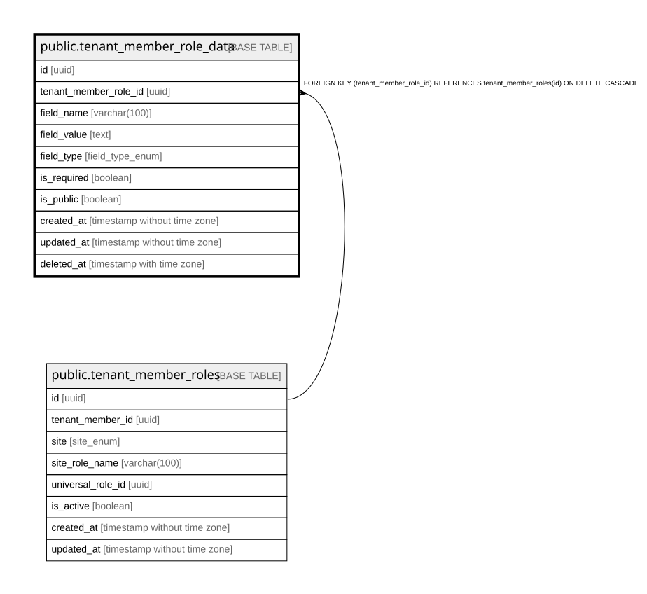

# public.tenant_member_role_data

## Columns

| Name | Type | Default | Nullable | Children | Parents | Comment |
| ---- | ---- | ------- | -------- | -------- | ------- | ------- |
| id | uuid | gen_random_uuid() | false |  |  |  |
| tenant_member_role_id | uuid |  | false |  | [public.tenant_member_roles](public.tenant_member_roles.md) |  |
| field_name | varchar(100) |  | false |  |  |  |
| field_value | text |  | true |  |  |  |
| field_type | field_type_enum | 'text'::field_type_enum | true |  |  |  |
| is_required | boolean | false | true |  |  |  |
| is_public | boolean | true | true |  |  |  |
| created_at | timestamp without time zone | now() | true |  |  |  |
| updated_at | timestamp without time zone | now() | true |  |  |  |
| deleted_at | timestamp with time zone |  | true |  |  |  |

## Constraints

| Name | Type | Definition |
| ---- | ---- | ---------- |
| tenant_member_role_data_pkey | PRIMARY KEY | PRIMARY KEY (id) |
| tenant_member_role_data_tenant_member_role_id_fkey | FOREIGN KEY | FOREIGN KEY (tenant_member_role_id) REFERENCES tenant_member_roles(id) ON DELETE CASCADE |
| unique_field_per_tenant_role | UNIQUE | UNIQUE (tenant_member_role_id, field_name) |

## Indexes

| Name | Definition |
| ---- | ---------- |
| tenant_member_role_data_pkey | CREATE UNIQUE INDEX tenant_member_role_data_pkey ON public.tenant_member_role_data USING btree (id) |
| unique_field_per_tenant_role | CREATE UNIQUE INDEX unique_field_per_tenant_role ON public.tenant_member_role_data USING btree (tenant_member_role_id, field_name) |
| idx_tenant_member_role_data_deleted_at | CREATE INDEX idx_tenant_member_role_data_deleted_at ON public.tenant_member_role_data USING btree (deleted_at) WHERE (deleted_at IS NULL) |
| idx_tenant_member_role_data_field_name | CREATE INDEX idx_tenant_member_role_data_field_name ON public.tenant_member_role_data USING btree (field_name) |
| idx_tenant_member_role_data_role_id | CREATE INDEX idx_tenant_member_role_data_role_id ON public.tenant_member_role_data USING btree (tenant_member_role_id) |

## Triggers

| Name | Definition |
| ---- | ---------- |
| update_tenant_member_role_data_updated_at | CREATE TRIGGER update_tenant_member_role_data_updated_at BEFORE UPDATE ON public.tenant_member_role_data FOR EACH ROW EXECUTE FUNCTION update_updated_at_column() |

## Relations

---

> Generated by [tbls](https://github.com/k1LoW/tbls)
