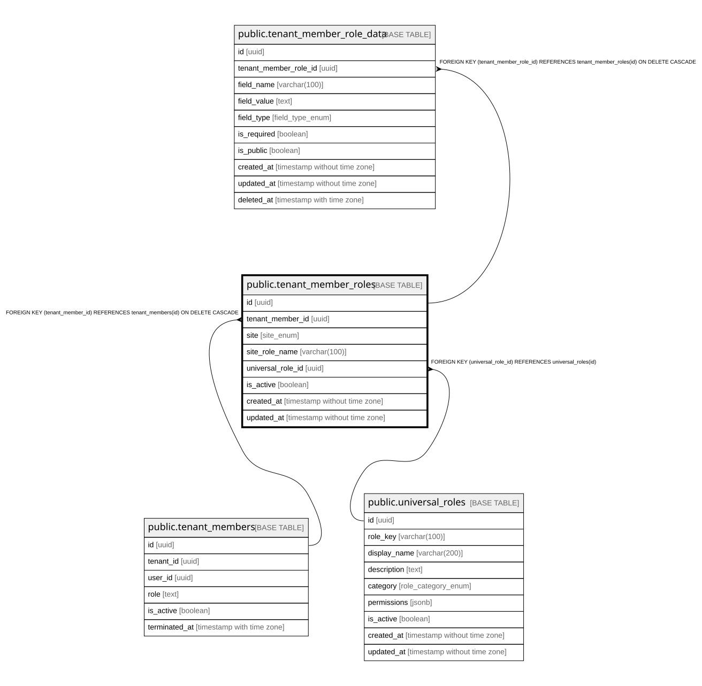

# public.tenant_member_roles

## Columns

| Name | Type | Default | Nullable | Children | Parents | Comment |
| ---- | ---- | ------- | -------- | -------- | ------- | ------- |
| id | uuid | gen_random_uuid() | false | [public.tenant_member_role_data](public.tenant_member_role_data.md) |  |  |
| tenant_member_id | uuid |  | false |  | [public.tenant_members](public.tenant_members.md) |  |
| site | site_enum |  | false |  |  |  |
| site_role_name | varchar(100) |  | false |  |  |  |
| universal_role_id | uuid |  | true |  | [public.universal_roles](public.universal_roles.md) |  |
| is_active | boolean | true | true |  |  |  |
| created_at | timestamp without time zone | now() | true |  |  |  |
| updated_at | timestamp without time zone | now() | true |  |  |  |

## Constraints

| Name | Type | Definition |
| ---- | ---- | ---------- |
| tenant_member_roles_pkey | PRIMARY KEY | PRIMARY KEY (id) |
| tenant_member_roles_tenant_member_id_fkey | FOREIGN KEY | FOREIGN KEY (tenant_member_id) REFERENCES tenant_members(id) ON DELETE CASCADE |
| unique_tenant_member_site_role | UNIQUE | UNIQUE (tenant_member_id, site) |
| tenant_member_roles_universal_role_id_fkey | FOREIGN KEY | FOREIGN KEY (universal_role_id) REFERENCES universal_roles(id) |

## Indexes

| Name | Definition |
| ---- | ---------- |
| tenant_member_roles_pkey | CREATE UNIQUE INDEX tenant_member_roles_pkey ON public.tenant_member_roles USING btree (id) |
| unique_tenant_member_site_role | CREATE UNIQUE INDEX unique_tenant_member_site_role ON public.tenant_member_roles USING btree (tenant_member_id, site) |
| idx_tenant_member_roles_member | CREATE INDEX idx_tenant_member_roles_member ON public.tenant_member_roles USING btree (tenant_member_id) |
| idx_tenant_member_roles_site | CREATE INDEX idx_tenant_member_roles_site ON public.tenant_member_roles USING btree (site) |
| idx_tenant_member_roles_site_role_name | CREATE INDEX idx_tenant_member_roles_site_role_name ON public.tenant_member_roles USING btree (site_role_name) |
| idx_tenant_member_roles_universal_role | CREATE INDEX idx_tenant_member_roles_universal_role ON public.tenant_member_roles USING btree (universal_role_id) |

## Triggers

| Name | Definition |
| ---- | ---------- |
| update_tenant_member_roles_updated_at | CREATE TRIGGER update_tenant_member_roles_updated_at BEFORE UPDATE ON public.tenant_member_roles FOR EACH ROW EXECUTE FUNCTION update_updated_at_column() |

## Relations

---

> Generated by [tbls](https://github.com/k1LoW/tbls)
