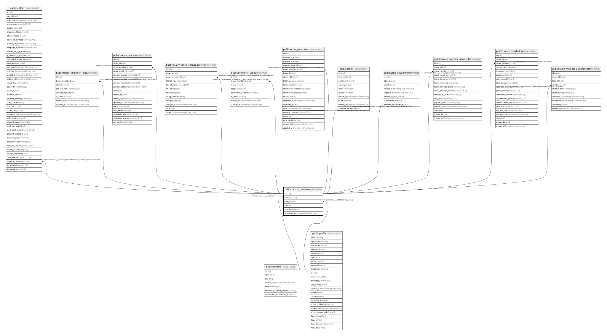

# public.tenant_members

## Columns

| Name | Type | Default | Nullable | Children | Parents | Comment |
| ---- | ---- | ------- | -------- | -------- | ------- | ------- |
| id | uuid |  | false | [public.orders](public.orders.md) [public.tenant_member_roles](public.tenant_member_roles.md) [public.salary_payments](public.salary_payments.md) [public.salary_config_change_history](public.salary_config_change_history.md) [public.promoter_codes](public.promoter_codes.md) [public.order_commissions](public.order_commissions.md) [public.tables](public.tables.md) [public.table_sessions](public.table_sessions.md) [public.salary_overtime_payments](public.salary_overtime_payments.md) [public.salary_liquidaciones](public.salary_liquidaciones.md) [public.table_member_assignments](public.table_member_assignments.md) |  |  |
| tenant_id | uuid |  | false |  | [public.tenants](public.tenants.md) |  |
| user_id | uuid |  | false |  | [public.profile](public.profile.md) |  |
| role | text | 'member'::text | false |  |  |  |
| is_active | boolean | true | false |  |  |  |
| terminated_at | timestamp with time zone |  | true |  |  |  |

## Constraints

| Name | Type | Definition |
| ---- | ---- | ---------- |
| tenant_members_user_id_profile_id_fk | FOREIGN KEY | FOREIGN KEY (user_id) REFERENCES profile(id) |
| tenant_members_pkey | PRIMARY KEY | PRIMARY KEY (id) |
| tenant_members_tenant_id_tenants_id_fk | FOREIGN KEY | FOREIGN KEY (tenant_id) REFERENCES tenants(id) |

## Indexes

| Name | Definition |
| ---- | ---------- |
| tenant_members_pkey | CREATE UNIQUE INDEX tenant_members_pkey ON public.tenant_members USING btree (id) |

## Triggers

| Name | Definition |
| ---- | ---------- |
| trg_enforce_tenant_owner_minimum | CREATE TRIGGER trg_enforce_tenant_owner_minimum BEFORE DELETE OR UPDATE ON public.tenant_members FOR EACH ROW EXECUTE FUNCTION enforce_tenant_owner_minimum() |

## Relations

---

> Generated by [tbls](https://github.com/k1LoW/tbls)
